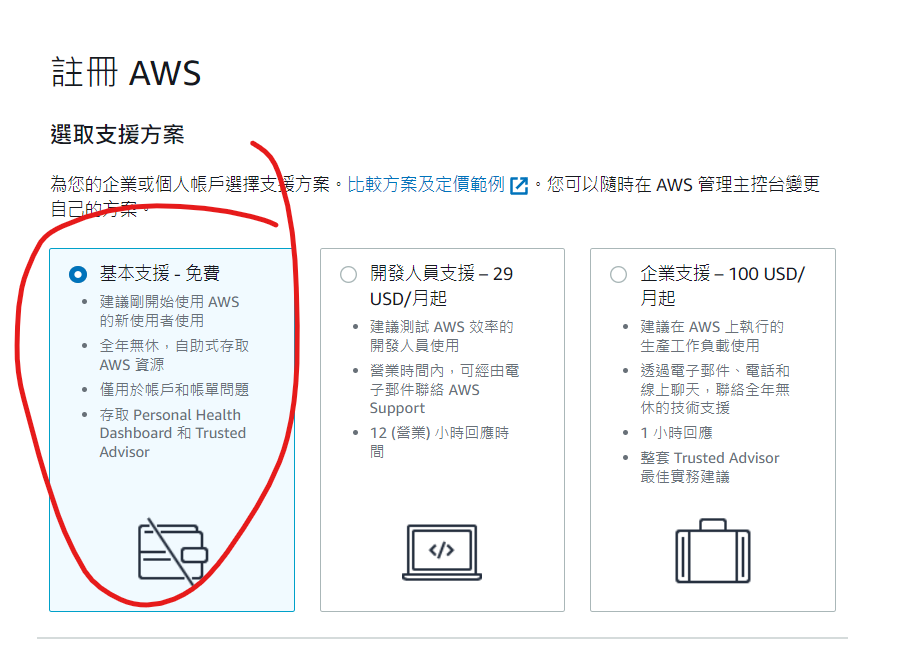

# 課程概述

## 雲端最重要技術：
1. 運算
2. 儲存
3. 網路

## 網路加速常見方法：

- 快取：將經常訪問的資料儲存在快取記憶體中，以減少對資料庫或其他後端資源的請求次數。常見的快取技術包括 Redis、Memcached、Ehcache 等。
- 壓縮：將資料壓縮後傳輸，可以減少資料傳輸量。常見的壓縮算法包括 Gzip、Brotli 等。
- CDN：將資料儲存在多個節點上，並根據用戶的 IP 地址將請求導向最近的節點，以減少資料傳輸距離。
- CDN+壓縮：使用 CDN 和壓縮技術相結合，可以進一步提升網路加速效果。
- 內容分發：將不同類型的內容儲存在不同的節點上，以便用戶可以從最適合他們的節點上獲取內容。例如，圖片可以儲存在 CDN 節點上，影片可以儲存在專門的影片節點上。
- 負載平衡：將來自多個用戶的請求分散到多個伺服器上，以提升伺服器的處理能力。

Redis、Memcached 等快取技術需要大量記憶體，因此在選擇時需要考慮應用程式的需求。如果應用程式需要儲存大量資料，則需要使用有足夠記憶體的快取伺服器。

## AWS EC2 計算 (EC2計算、S3 storage、VPC)

### EC2計算
> EC2 是 Amazon Elastic Compute Cloud 的縮寫，它是 AWS 提供的按需計算服務。EC2 讓您可以按需啟動、停止、修改和擴展虛擬機器 (VM)，這些 VM 稱為 EC2 執行個體。EC2 可讓您根據您的需求彈性地擴展計算容量，而無需購買和維護自己的硬體。

EC2 提供多種執行個體類型可供選擇，每種執行個體類型都有不同的 CPU、記憶體、儲存和網路容量。您可以根據您的應用程式需求選擇合適的執行個體類型。

EC2 還提供多種功能可幫助您管理您的執行個體，例如：

- 安全性：EC2 提供多種安全功能可幫助保護您的執行個體，例如安全群組、標籤和密鑰對。
- 自動擴展：EC2 提供自動擴展功能，可根據您的需求自動增加或減少執行個體數量。
- 監控：EC2 提供監控功能，可幫助您監控您的執行個體的效能和健康狀況。

EC2 是一種功能強大的計算服務，可用於各種應用程式，包括：

- 網站和應用程式
- 資料分析
- 機器學習
- 遊戲

### S3 儲存
> S3 是 Amazon Simple Storage Service 的縮寫，它是 AWS 提供的物件儲存服務。S3 提供高可靠、高可用和低成本的儲存服務，您可以使用它來儲存各種資料，例如檔案、影像、影片和資料庫。

S3 提供多種功能可幫助您管理您的資料，例如：

- 存取控制：S3 提供多種存取控制功能，可幫助您保護您的資料，例如 ACL、IAM 和加密。
- 備份和復原：S3 提供備份和復原功能，可幫助您保護您的資料免受意外損失。
- 分析：S3 提供分析功能，可幫助您分析您的資料。

S3 是一種靈活的儲存服務，可用於各種應用程式，包括：

- 網站和應用程式部署
- 資料備份和復原
- 雲端原生應用程式
- 大數據分析

### VPC
> VPC 是 Amazon Virtual Private Cloud 的縮寫，它是 AWS 提供的虛擬網路服務。VPC 讓您可以建立自己的虛擬網路，並將其隔離在其他 AWS 使用者的網路之外。

VPC 提供多種功能可幫助您管理您的網路，例如：

- 安全性：VPC 提供多種安全功能可幫助保護您的網路，例如網路安全群組、路由表和網路 ACL。
- 彈性：VPC 可讓您根據您的需求彈性地擴展您的網路。
- 可用性：VPC 可讓您將您的網路部署到多個可用區域，以提高可用性。

VPC 是一種安全可靠的網路服務，可用於各種應用程式，例如：

- 資料中心遷移
- 雲端原生應用程式
- 網路安全

## Serverless

Serverless 是一種雲端運算的架構，其中開發人員無需管理伺服器即可部署和運行應用程式。Serverless 應用程式通常是使用事件驅動的方式來運行，例如當使用者觸發事件時，應用程式會被觸發並執行。

Serverless 的優點包括：
- 成本效益：Serverless 應用程式只需為使用的資源付費，因此可以大幅降低成本。
- 簡易性：Serverless 應用程式不需要管理伺服器，因此可以簡化開發和部署流程。
- 彈性：Serverless 應用程式可以根據需求彈性地擴展或縮減容量。

# AWS 註冊

