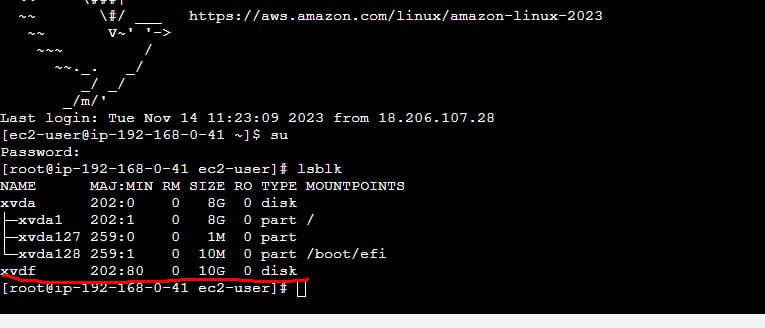

# Serverless
無伺服器運算可讓您建置和執行應用程式與服務，而無須擔心伺服器的問題。使用無伺服器運算，您的應用程式仍然在伺服器上執行，但所有伺服器管理工作都由 AWS 完成。您可以使用 AWS 及其無伺服器平台在經濟實惠的服務上建置和部署應用程式，這些服務提供內建的應用程式可用性和彈性擴展功能。這可讓您專注在應用程式程式碼，無須擔心佈建、設定和管理伺服器。

## Ebs (彈性塊儲存)。
為您的虛擬機器提供一個磁碟，例如 /dev/vda 或 /dev/vdb。

## Rds (關係型資料庫服務)。
亞馬遜託管資料庫服務。您可以讓亞馬遜為您管理您的資料庫。可以從 Oracle、sal server、postgres、MySQL 和 Amazon Arura 中進行選擇。

>參考：https://docs.aws.amazon.com/AWSEC2/latest/UserGuide/ebs-using-volumes.html


> 課程參考：[連結](https://github.com/stereomp3/note/blob/main/linux/111semester01/13-.md#LAMP)

```php
<?php
$servername="testdb.ciwmmmyxlgti.us-east-1.rds.amazonaws.com";
$username="user";    
$password="12345678";
$dbname="testdb";

$conn = new mysqli($servername, $username, $password, $dbname);

if($conn->connect_error){
    die("connection failed: " . $conn->connect_error);
}
else{
    echo "connect OK!" . "<br>";
}

$sql="select name,phone from addrbook";
$result=$conn->query($sql);

if($result->num_rows>0){
    while($row=$result->fetch_assoc()){
        echo "name: " . $row["name"] . "\tphone: " . $row["phone"] . "<br>";
    }
} else {
    echo "0 record";
}
?>
```


> 課程參考：[連結](https://docs.aws.amazon.com/AWSEC2/latest/UserGuide/ebs-using-volumes.html)





> 在第二台不要在執行mkfs...因為在第一台機器已經格式化過了。

## 重要提醒
> EC2中的snapshot要是空的,才不會被收費


> 參考這個影片去把snapshot給刪除：[連結](https://www.youtube.com/watch?v=XeBtYT-goP4)