# Amazon EFS（彈性檔案系統）
> 課程參考：[連結](https://docs.aws.amazon.com/zh_tw/efs/latest/ug/wt1-test.html)

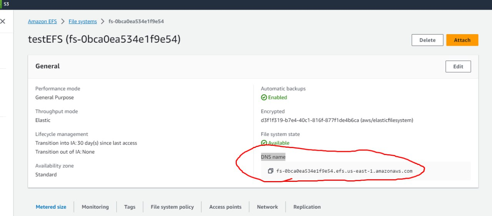

## AWS 身分和存取管理 (IAM)

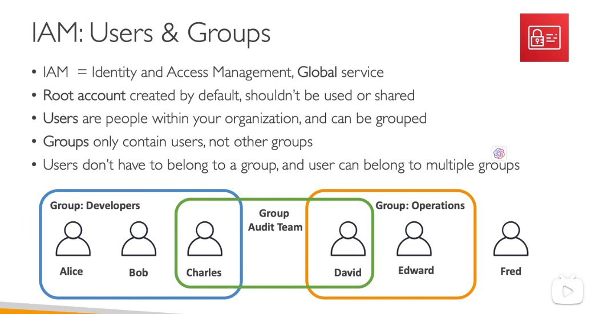

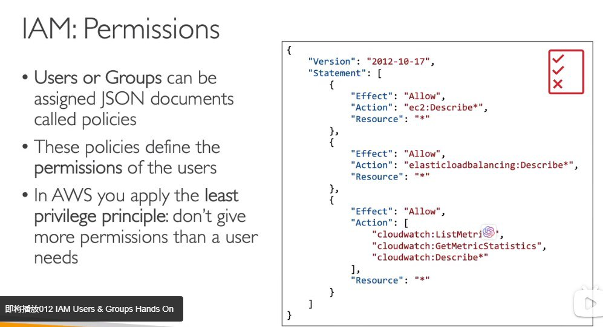

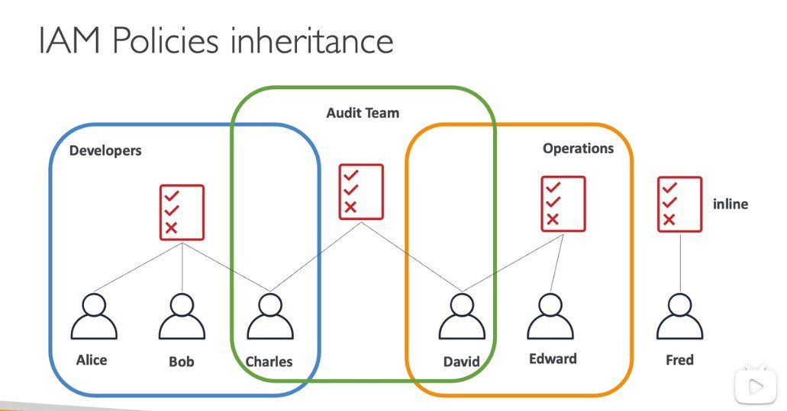

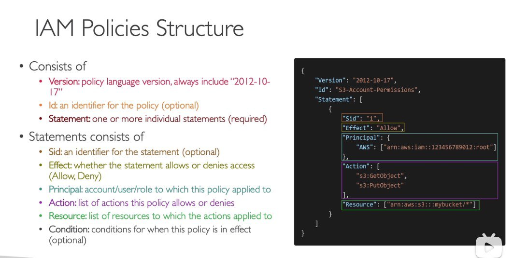

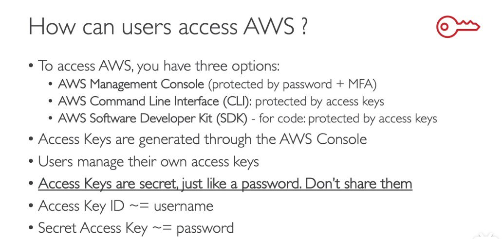

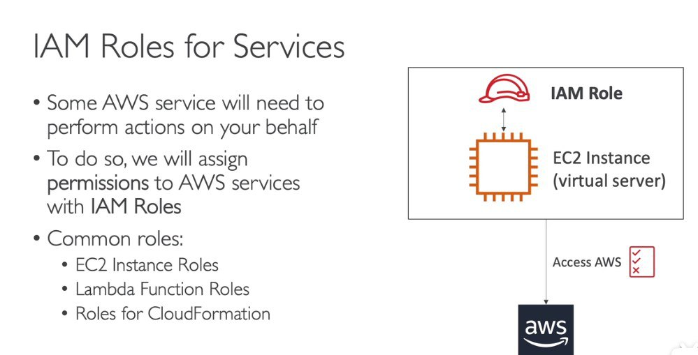

## IAM 實作

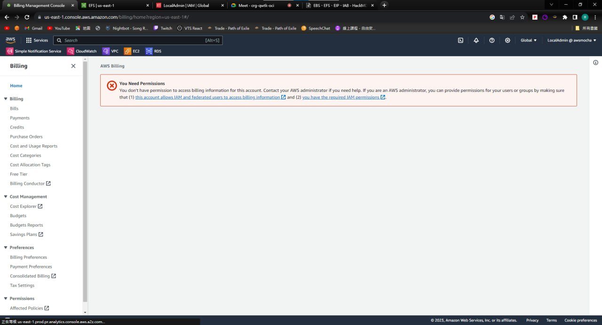

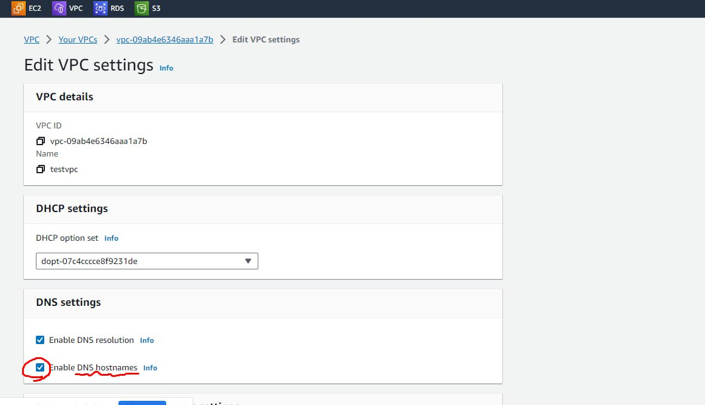

```bash
sudo yum install -y amazon-efs-utils
```

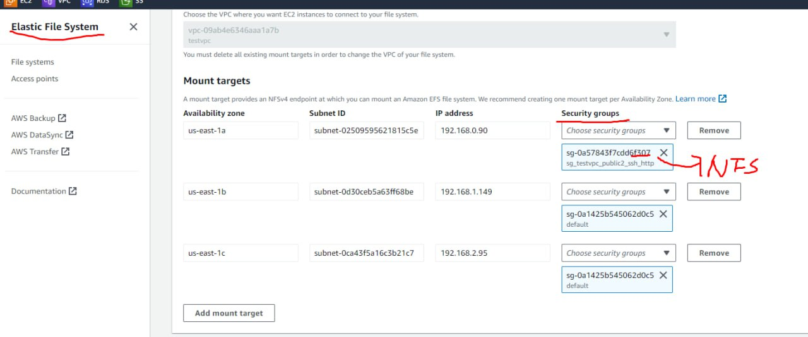

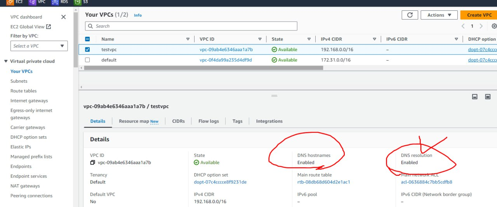

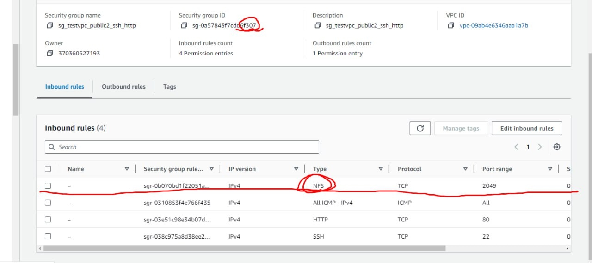

## AWS 存取
訪問AWS可以透過多種方式完成，包括網站、AWS CLI和SDK。

訪問方法：
  - 網站訪問：
    - 透過官方網站存取AWS服務。
  - AWS CLI：
    - 利用 AWS 命令​​列介面與 AWS 服務進行高效率互動。
  - SDK接入：
    - 利用軟體開發套件 (SDK) 以程式設計方式存取 AWS 資源。

## 步驟 [在 EC2 執行個體上掛載檔案系統並測試](https://docs.aws.amazon.com/zh_tw/efs/latest/ug/wt1-test.html)
1. VPC—>enable DNS resoultion

2. EFS  建立file system   3. 建立Access Point

4. 修改一個security group,把NFS規則加上

5. 修改EFS中的EFS

6. 建立兩台EC2，在EC2上：
```
sudo yum install -y amazon-efs-utils
mkdir ~/efs-mount-point
sudo mount -t nfs -o nfsvers=4.1,rsize=1048576,wsize=1048576,hard,timeo=600,retrans=2,noresvport mount-target-DNS:/   ~/efs-mount-point
```

