考取證照：[連結](https://www.bilibili.com/video/BV1hJ411U7vd?p=1&vd_source=f74a220251f63c0d2381f8c51b2cbdee)

AWS 課程自學：[連結](https://explore.skillbuilder.aws/learn/home)

---
# 亞馬遜簡單儲存服務（S3）：


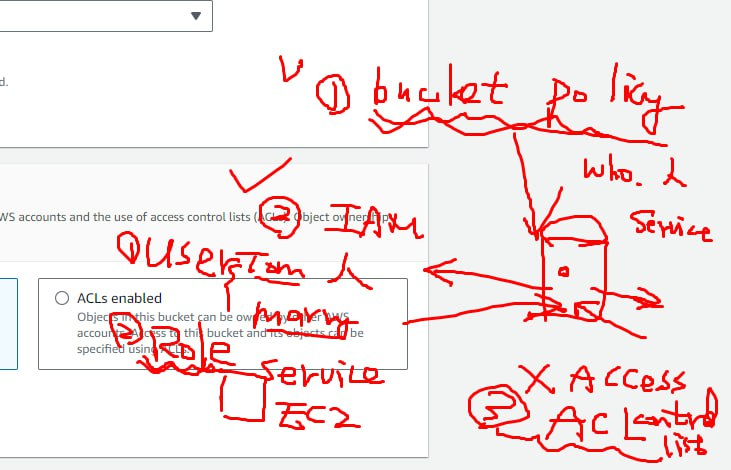

## 配置方面 (儲存桶政策)：

目的：定義誰可以存取您的儲存桶以及他們可以執行哪些操作。

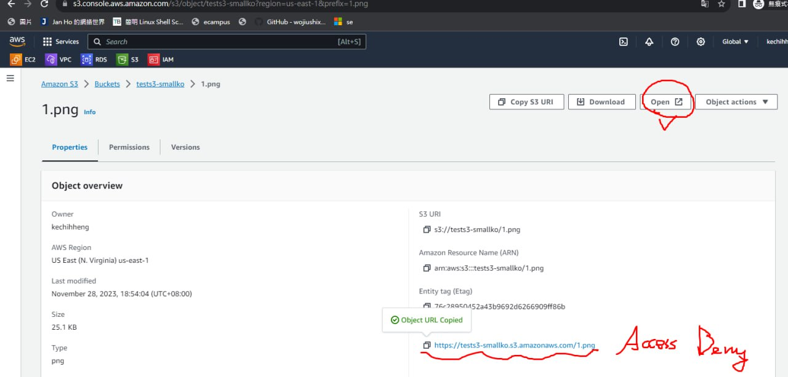

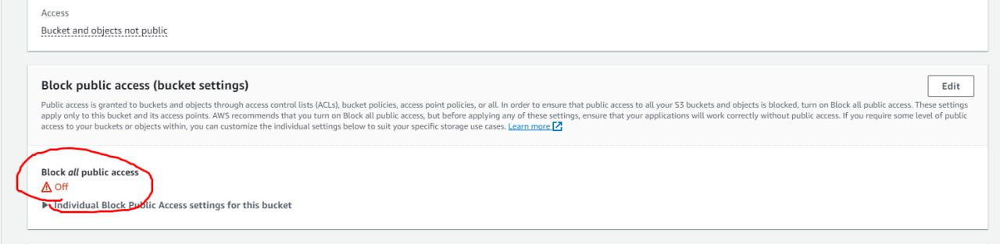

範例：允許任何人（"Principal": ""）取得特定 S3 存儲桶（"arn:aws:s3:::your-bucket-name/"）中的物件。
```
{
    "Version": "2012-10-17",
    "Statement": [
        {
            "Sid": "PublicReadGetObject",
            "Effect": "Allow",
            "Principal": "*",
            "Action": "s3:GetObject",
            "Resource": "arn:aws:s3:::your-bucket-name/*"
        }
    ]
}
```

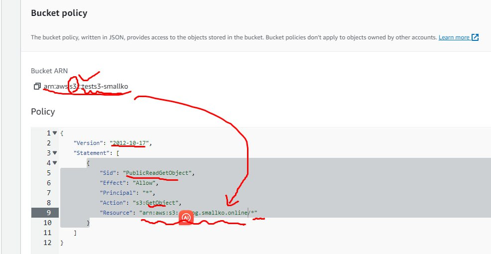

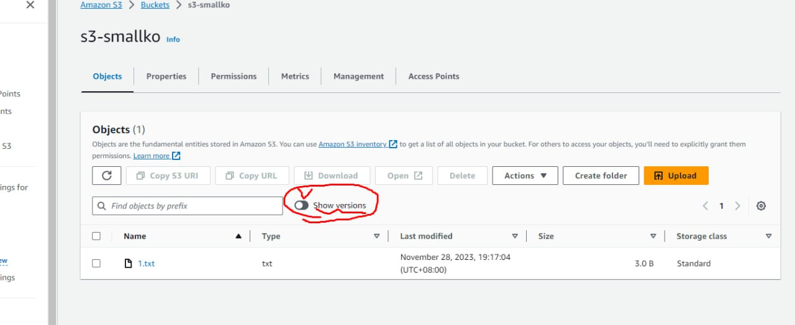

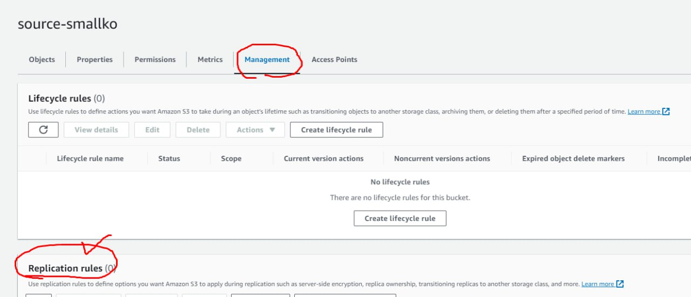

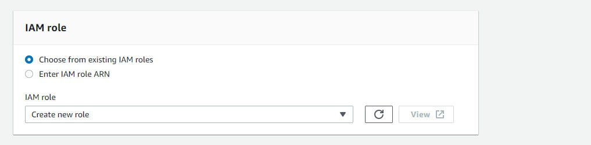

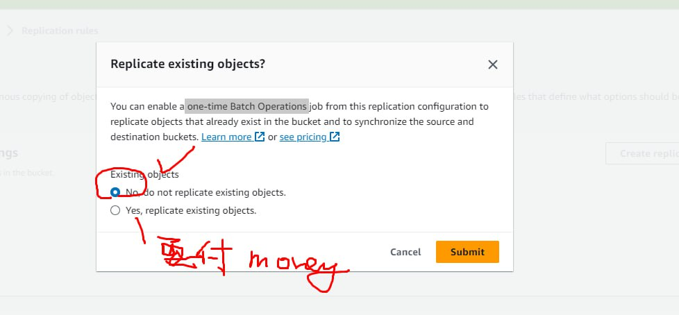

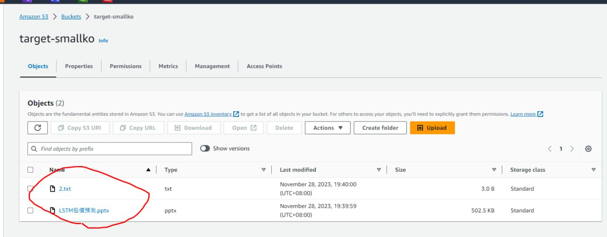

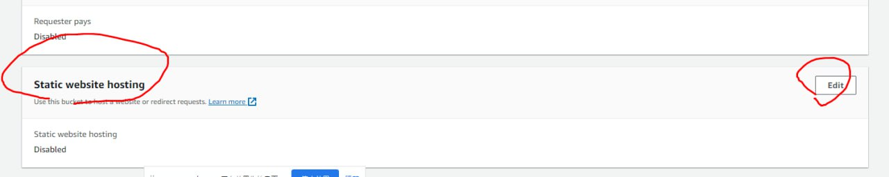

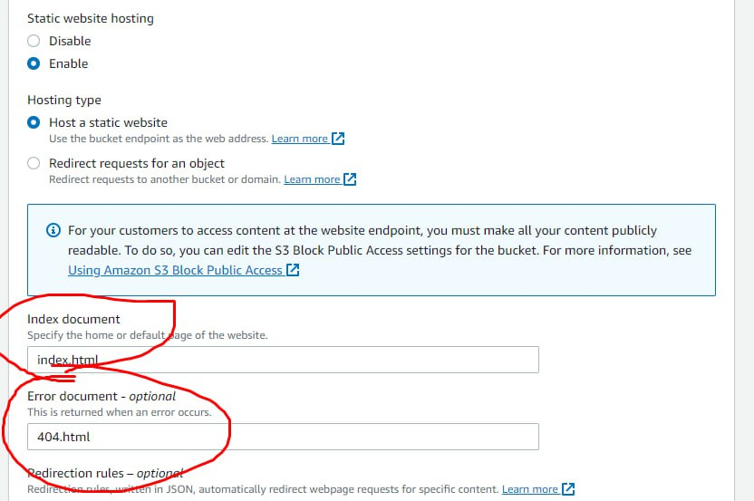

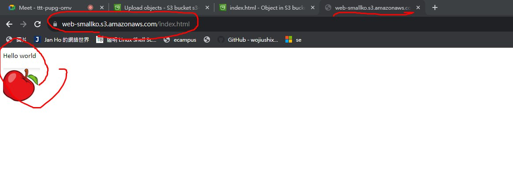

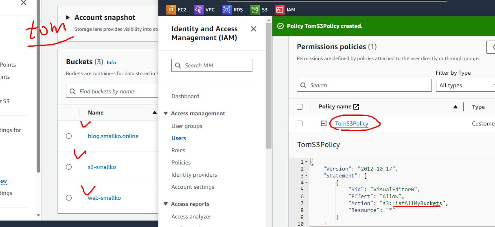

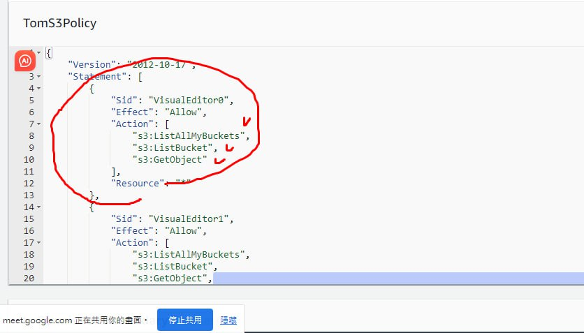

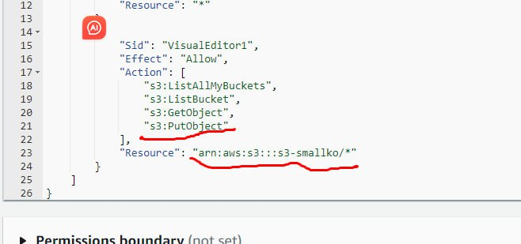

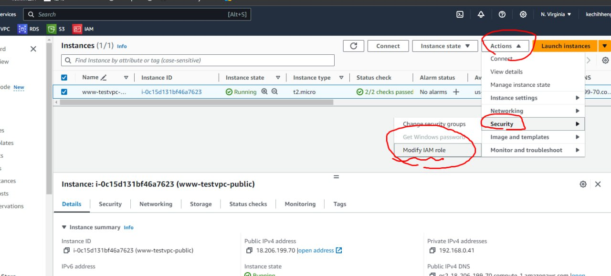

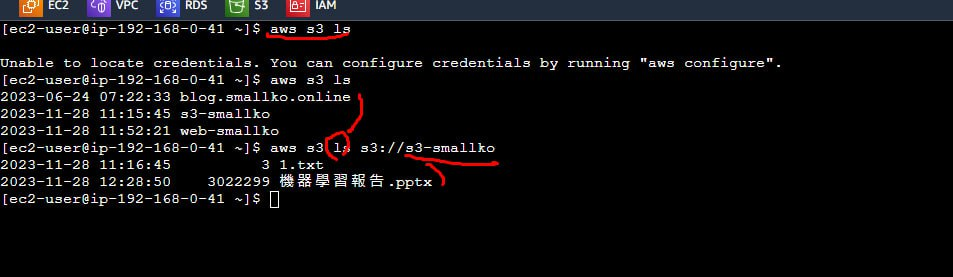

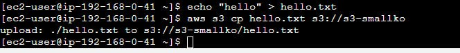