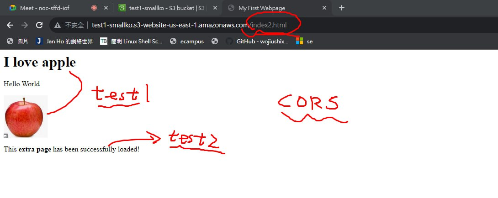

# 命令列介面 - CLI

> 課程參考：[連結](https://docs.aws.amazon.com/zh_tw/cli/latest/userguide/getting-started-install.html)


> 課程參考：[連結](https://blog.gtwang.org/linux/linux-aws-command-upload-download-s3-file-tutorial-examples/#google_vignette)


## SDK

> 課程參考：[連結](https://zhuanlan.zhihu.com/p/590965831)

```
import boto3

s3 = boto3.resource("s3")

# 创建一个 bucket
bucket = s3.create_bucket(Bucket="my-bucket")

# 获得所有的 bucket, boto 会自动处理 API 的翻页等信息。
for bucket in s3.buckets.all():
    print(bucket.name)
```


```
import boto3

s3 = boto3.resource("s3")

# 获得所有的 bucket, boto 会自动处理 API 的翻页等信息。
for bucket in s3.buckets.all():
    print(bucket.name)
```


## Route53

> 申請網域名稱：[連結](https://tw.godaddy.com/offers/godaddy?isc=sem1year&countryview=1&currencyType=TWD&cdtl=c_20012948307.g_146146597897.k_kwd-93455629.a_655882536885.d_c.ctv_g&bnb=b&gad_source=1&gclid=Cj0KCQiAsburBhCIARIsAExmsu4MMGMKBCDAJzCsNSPAeOYylK532biHh2vWVCb53cJxfQrrD1Gn60oaAoZXEALw_wcB)


```
{
    "Version": "2012-10-17",
    "Statement": [
        {
            "Sid": "PublicReadGetObject",
            "Effect": "Allow",
            "Principal": "*",
            "Action": "s3:GetObject",
            "Resource": "arn:aws:s3:::your-bucket-name/*"
        }
    ]
}
```

## 跨域資源共享 (CORS)

是一種使用額外HTTP 標頭令目前瀏覽網站的使用者代理取得存取其他來源（網域）伺服器特定資源權限的機制。

1. 首先我們創建兩個桶

2. 上傳index.html

```html
<html>
  <head>
    <title>My First Webpage</title>
  </head>
  <body>
    <h1>I love apple</h1>
	<p>Hello World</p>
  <body>
  
  
  <!-- CORS demo -->
  <div id="tofetch"/>
  <script>
    var tofetch = document.getElementById("tofetch");
	
	fetch('http://bucket-z22756392z-us-east-2.s3-website.us-east-2.amazonaws.com/extra.html')
	.then((response) => {
	  return response.text();
	})
	.then((html) => {
	  tofetch.innerHTML = html
	});
  </script>
</html>
```

3. 第二個桶子我們上傳 extra.html

```html
<p>This <strong>extra page</strong> has been successfully loaded!</p>
```

4. 然後修改第一個bucket的index.html的CORS權限來取得

```
[
 {
	 "AllowedHeaders": [
	   "Authorization"
	 ],
	 "AllowedMethods": [
	   "GET"
	 ],
	 "AllowedOrigins": [
	   "http://bucket-z22756392z-us-east-2.s3-website.us-east-1.amazonaws.com"
	 ],
	 "ExposeHeaders": [],
	 "MaxAgeSeconds": 3000
 }
]
```





