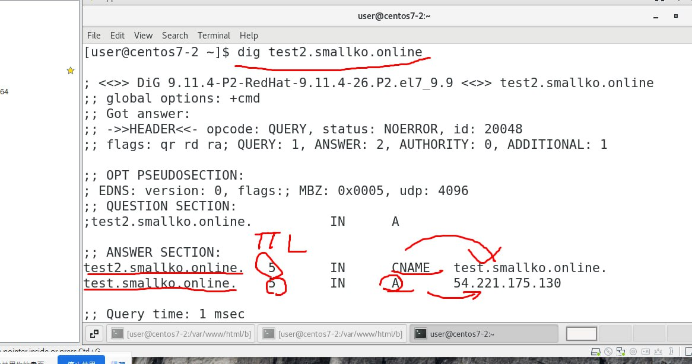

```
#!/bin/bash
yum update -y
yum install -y httpd.x86_64
systemctl start httpd.service
systemctl enable httpd.service
echo “Hello World from $(hostname -f)” > /var/www/html/index.html
```


> 參考連結：https://whatismyipaddress.com/


## 重要提醒
> 要先刪除cloud front distributon,才能刪除aws cerfiticate manager中的資料