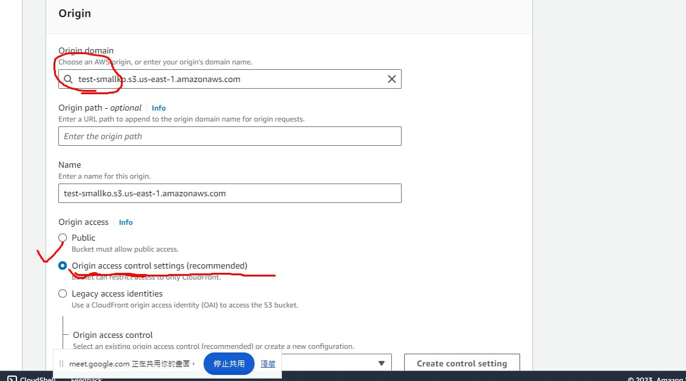

## 使用 CloudFront 連接到網站的 S3 儲存桶




```
{
        "Version": "2008-10-17",
        "Id": "PolicyForCloudFrontPrivateContent",
        "Statement": [
            {
                "Sid": "AllowCloudFrontServicePrincipal",
                "Effect": "Allow",
                "Principal": {
                    "Service": "cloudfront.amazonaws.com"
                },
                "Action": "s3:GetObject",
                "Resource": "arn:aws:s3:::test-z22756392z/*",
                "Condition": {
                    "StringEquals": {
                      "AWS:SourceArn": "arn:aws:cloudfront::803647625959:distribution/EU9V24PLPS4QG"
                    }
                }
            }
        ]
      }
```


## WAF（Web 應用程式防火牆）


此腳本來捲曲我們的雲端前端IP以達到速率限制

```py
for i in {1..110}
do
  echo $i
  result=curl -o /dev/null -s -w %{http_code} https://d36xl9iuaw2xue.cloudfront.net/
  if [[ "$result" == "200" ]] ; then
    echo "ok"
  else
    echo "fail"
  fi
done
```


使用 Python 的 Boto3 套件來操作 AWS 的 DynamoDB。

```py
import boto3
import os
os.environ['AWS_DEFAULT_REGION'] = 'us-east-1'


_TableName_ = "addrbook"

client = boto3.client('dynamodb')

DB = boto3.resource('dynamodb')
table = DB.Table(_TableName_)

response = table.get_item(
    Key={
        'name': "mary"
    }
)
response["Item"]

print(response['Item'])
```


## 重要提醒
>要記得刪除web ACL，會被算錢。
