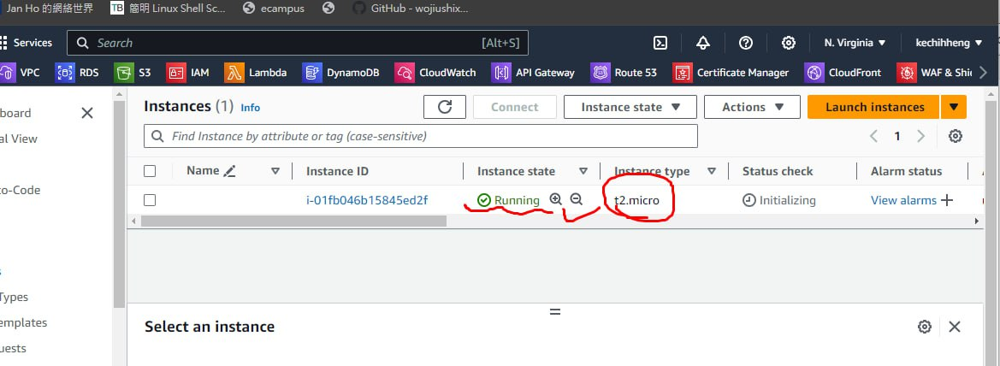

# Lambda 服務設定

前往 IAM，然後選擇「Roles」。


```py
import json
import boto3

client = boto3.client('dynamodb')

def lambda_handler(event, context):
  data = client.get_item(
    TableName='addrbook',
    Key={
        'name': {
          'S': 'tom'
        }
    }
  )
  print(data['Item'])
  response = {
      'statusCode': 200,
      'body': json.dumps(data['Item']),
      'headers': {
        'Content-Type': 'application/json',
        'Access-Control-Allow-Origin': '*'
      },
  }
  return response
```


```py
import json
import boto3
client = boto3.client('dynamodb')
def lambda_handler(event, context):
    PutItem = client.put_item(
        TableName='addrbook',
        Item={
            'name': {
              'S': 'john'
            },
            'phone': {
              'S': '0931987654'
            }
        }
      )
    response = {
      'statusCode': 200,
      'body': json.dumps(PutItem)
    }
    return response
```


```py
import json
import boto3
import logging

logger = logging.getLogger()
logger.setLevel(logging.INFO)

dynamodb = boto3.resource('dynamodb',region_name='us-east-1')

def lambda_handler(event, context):
  print(event)
  data = {
    'Items' : "Bad Request"
  }
  statusCode = 200
  path = event["path"]
  httpMethod = event["httpMethod"]
  table = dynamodb.Table('addrbook')
  if httpMethod == 'GET' and path == '/addrbook':
    data = table.scan()
  elif httpMethod == 'POST' and path == '/add_addrbook':
    if event['body'] is not None :
      body = json.loads(event['body'])

      table.put_item(
        Item={
          'name': body['name'],
          'phone': body['phone']
        },
      )

      data = {
        'Items' : "addrbook created statusCodeuccessfully"
      }
    else:
      data = {
        'Items' : "Invalid Payload"
      }
      statusCode = 400
  else:
    statusCode = 400

  print(data['Items'])
  response = {
    'statusCode': statusCode,
    'body': json.dumps(data['Items']),
    'headers': {
       'Content-Type': 'application/json',
    },
  }

  return response
```


## 部署API

使用新階段部署 API 並進行部署。


## 透過 terraform 操縱 aws
terraform：https://www.terraform.io/


```
# main.tf
variable "region" {
    type = string
    default = "us-east-1" # the region we would like to create in
    description="aws region" 
}

variable "amis" {
    type=map
    default = {
        us-east-1 = "ami-079db87dc4c10ac91" // ec2 ami type (this is free tier)
    }
    description = "ami id"

}

variable "instance_type" {
    type=string
    default = "t2.micro"
    description = "EC2 instance type"
}
```


```
provider "aws" {
  region = var.region
}

resource "aws_instance" "mytest_vm" {
  ami = lookup(var.amis, var.region)
  instance_type=var.instance_type
  
  tags = {
   # Name = "mytest",
 }
}
```





```
provider "aws" {
  region = var.region
}
//       type     , name
resource "aws_vpc" "testvpc1"{
    cidr_block="192.168.0.0/16"
    tags = {
        Name = "testvpc1"
    }
}

resource "aws_subnet" "testvpc-web" {
//Retrieve the TestVPC1 ID associated with this subnet to use it in the creation process.
    vpc_id = "${aws_vpc.testvpc1.id}"
    cidr_block = "192.168.1.0/24"
    tags = {
        Name = "testvpc-web"
    }
}
```

## 重要提醒
>Route53 中的 hosted zone 用完要刪除了，不然就會被扣錢。
