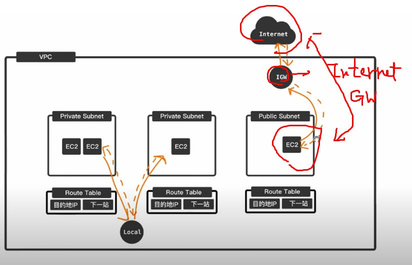
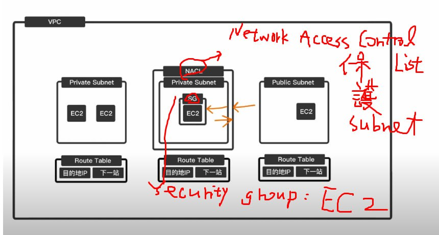
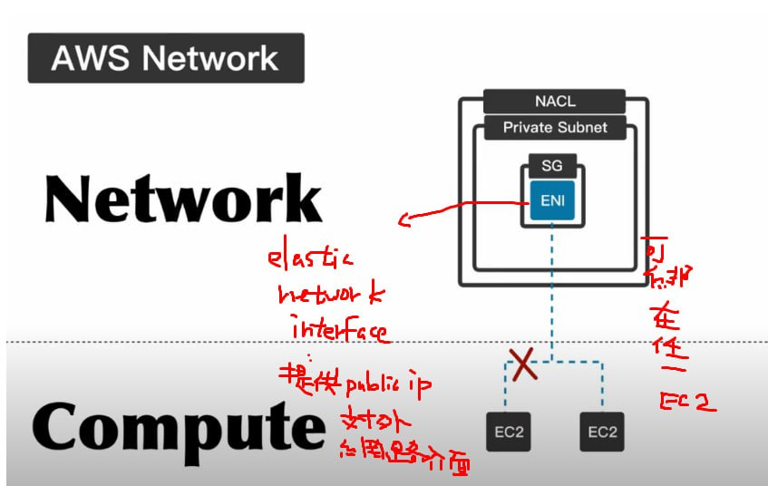
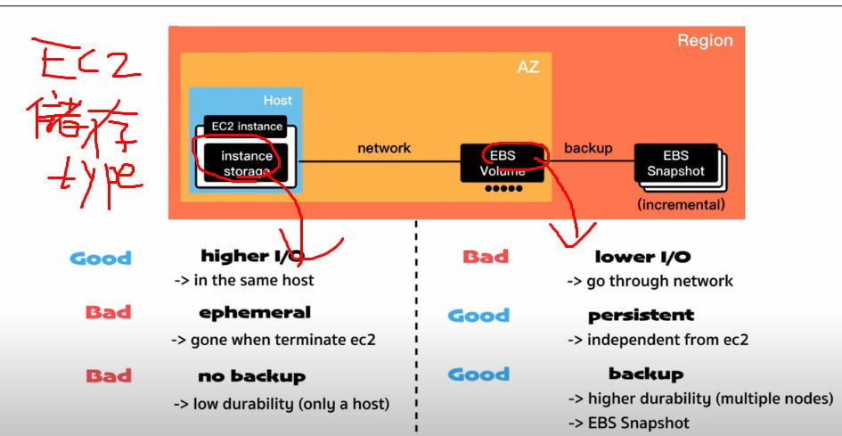
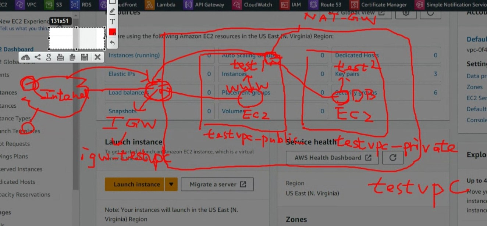

## 名詞介紹
Regions
> egion 是 AWS 基礎設施的獨立地理位置，提供可靠、安全且高效的雲端服務。
在選擇 Region 時，需要考慮以下因素：

- 地理位置：需要將資源部署到特定地理位置嗎？
- 可靠性：需要將資源部署到可靠的 Region 嗎？
- 成本：不同 Region 的價格可能不同。

awailable zone
> Availability Zone (AZ) 是 AWS 基礎設施的獨立地理位置，位於同一 Region 內。AZ 彼此獨立，但透過低延遲的網路連接相連。

Virtual Private Cloud—Amazon VPC
>　Amazon VPC 是 AWS 提供的私有雲服務，可讓您在 AWS 基礎設施之上構建和管理自己的虛擬網路。VPC 由您定義的子網路組成，子網路可用來指定您的 EC2 執行個體和其他 AWS 資源的位置。


subnet 對應 AZ
> 子網路可以對應到一個或多個 Availability Zones (AZ)




NACL
1. 是 AWS 提供的網路安全功能，可用來控制進出子網路的流量。

2. 是無狀態的，它只會檢查流量的來源和目的地，而不會檢查流量的狀態。


項目 | NACL | SG
--- | --- | ---
適用範圍 | VPC 中的子網路或 NAT 閘道 | EC2 執行個體
狀態 | 無狀態 | 有狀態
規則 | 基於 IP 地址和埠號碼 | 基於 IP 地址、埠號碼和來源/目的地端口
優點 | 簡單易用，適用於簡單的防火牆需求 | 功能強大，適用於複雜的防火牆需求
缺點 | 無法控制流量的狀態，例如是否為回應流量 | 需要對流量的狀態進行控制



ENI (Elastic Network Interface)
> 可用於將 Amazon EC2 執行個體連接到虛擬私有雲 (VPC) 中的子網路。ENI 可以有多個 IP 地址，並且可以附加到多個執行個體上。



instance storage
> 實例存儲是直接連接到 EC2 執行個體的存儲。它是一種臨時存儲，在實例停止或終止時會丟失。實例存儲是免費的，但僅限於少量存儲容量。

EBS
> 可連接到任何 EC2 執行個體的存儲。它是持久存儲，在實例停止或終止時保留。EBS 可以按需擴展，並提供多種性能選項。


Elastic Load Balancing (ELB)：
    **提高性能——** ELB 可以將流量分發到最近的後端服務器，以提高效能。


Amazon EC2 Auto Scaling (ASG) 是 AWS 提供的一種服務，可用於自動調整 EC2 執行個體的數量，以滿足您的應用程式的需求。如：電商平台雙十一訪問數暴增



## VPC 實作


### IGW
> IGW（Internet Gateway）是 AWS 提供的一種網路服務，可將您的 VPC 連接到公共網路。IGW 允許您的 VPC 中的實例與公網中的其他裝置和服務進行通訊。

透過 IGW 對外連接的步驟如下：

1. 在 VPC 中建立 IGW。
2. 將 EC2 執行個體連接到 IGW。
3. 在 EC2 執行個體上配置安全組規則，允許來自 Internet 的流量。


```bash
ssh -i myawsclass.pem ec2-user@{IP}
```
 > SSH 遠端連結 EC2
