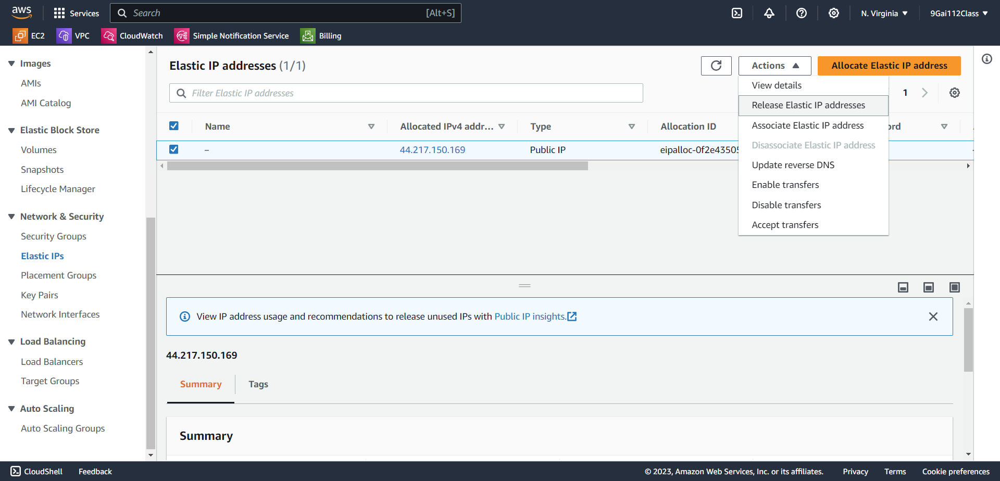

# Billing


## Elastic IP Address
>AWS Elastic IP Address（彈性 IP 地址）是一種靜態 IP 地址，可與 Amazon EC2 實例相關聯。Elastic IP 地址可以隨時與任何 EC2 實例相關聯，即使該實例已關機或更換了實例類型。

使用 AWS Elastic IP Address 可以帶來以下優點：

- 固定的 IP 地址：Elastic IP 地址是固定的，即使您更換 EC2 實例，也不會改變。這可以方便您記住和管理 IP 地址，並使您的應用程式更容易訪問。
- 可靠的連接：Elastic IP 地址使用 AWS 的全球網路，可提供可靠的連接。
- 彈性的擴展：您可以隨時將 Elastic IP 地址分配給新的 EC2 實例，從而輕鬆擴展您的應用程式。


## private server 增設後端資料庫


```bash
# SCP 將 .pem 傳進 EC2:testVPC public server
$ scp -i ./myawsclass.pem myawsclass.pem ec2-user@3.93.171.22:/home/ec2-user

# SSH 連線
$ ssh -i myawsclass.pem ec2-user@{testVPC_test1 IP}

$ ssh -i myawsclass.pem ec2-user@{testVPC_db IP}
```

> 如果 .pem 被系統警告太 Open `chmod 400 {檔名}`


```bash
$ route -n  # 路由表查詢
Kernel IP routing table
Destination     Gateway         Genmask         Flags Metric Ref    Use Iface
0.0.0.0         192.168.1.1     0.0.0.0         UG    512    0        0 enX0
192.168.0.2     192.168.1.1     255.255.255.255 UGH   512    0        0 enX0
192.168.1.0     0.0.0.0         255.255.255.0   U     512    0        0 enX0
192.168.1.1     0.0.0.0         255.255.255.255 UH    512    0        0 enX0
```
> 第一筆 0.0.0.0 是內定路由器，從路由表可知不能連上網

> NAT Gateway 要建置在 public server 上才可連出去

## 安裝 MariaDB 在 Amazon Linux
```bash
$ sudo dnf update
$ sudo dnf install mariadb105-server
```
[上課參考資料](https://linux.how2shout.com/installing-mariadb-on-amazon-linux-2023/)

```bash
$ sudo systemctl start mariadb  #啟動伺服器
$ sudo systemctl enable mariadb  #開機預設啟動

$ sudo mysql_secure_installation
```

設定步驟
```
1. Enter current password for root (enter for none):  # 按Enter跳過
2. Switch to unix_socket authentication [Y/n]  # 按n跳過
3. Change the root password? [Y/n]  # 按Y跳過
4. New password: # 輸入123456
5. Remove anonymous users? [Y/n]  # 按Y跳過
6. Disallow root login remotely? [Y/n]  # 按n跳過
7. Remove test database and access to it? [Y/n]  # 按Y跳過
8. Reload privilege tables now? [Y/n]  # 按Y跳過
```

### 刪除 NAT gateways 和 Route tables
> 因為 NAT gateways 會花錢所以安裝好 MariaDB 要記得刪除


## 創建 MariaDB
```SQL
-- 創建資料庫
CREATE USER user@'%' IDENTIFIED BY 'user';

-- 授予使用者權限
GRANT ALL PRIVILEGES ON * . * to 'user'@'%';

-- 刷新權限
FLUSH PRIVILEGES;
```

## 使用 public server 連進 MariaDB
```
$ mysql -u user -p -h {testVPC_db IP}
-bash: mysql: command not found
$ sudo yum install mariadb105  # 如果有誤下載 MariaDB
``` 


Release Elastic IP addresses 才不會被扣錢