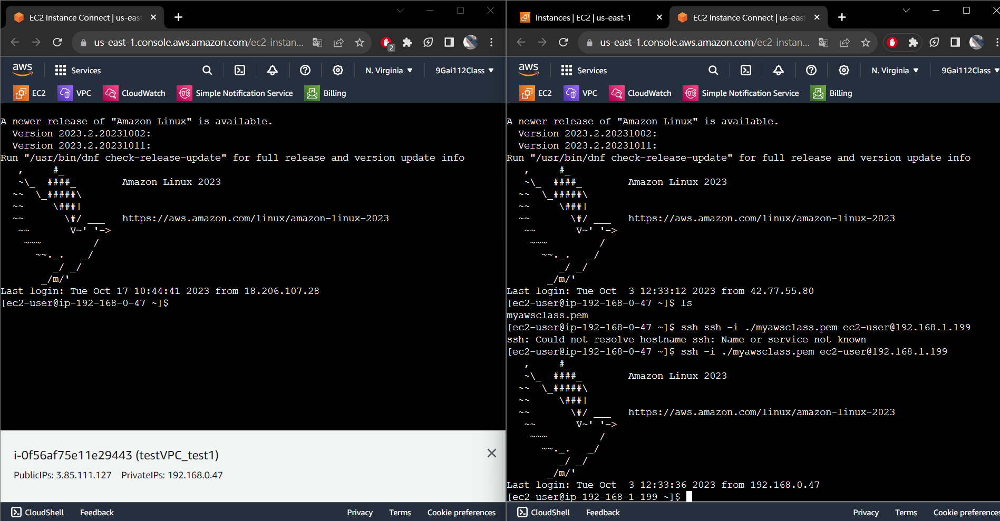
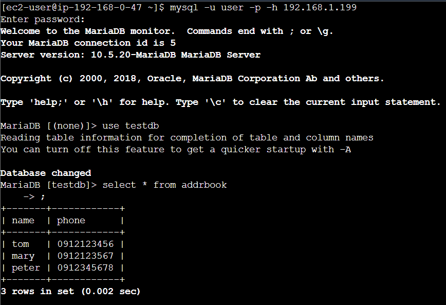
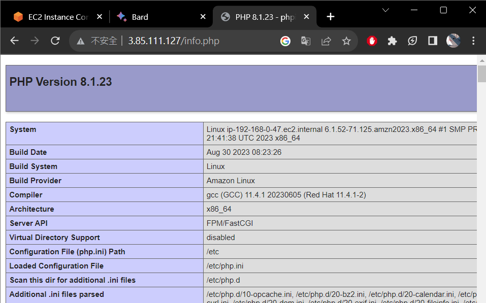
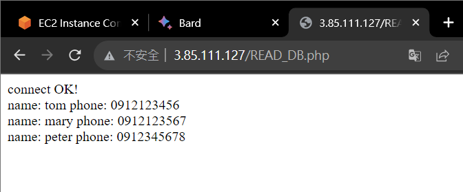
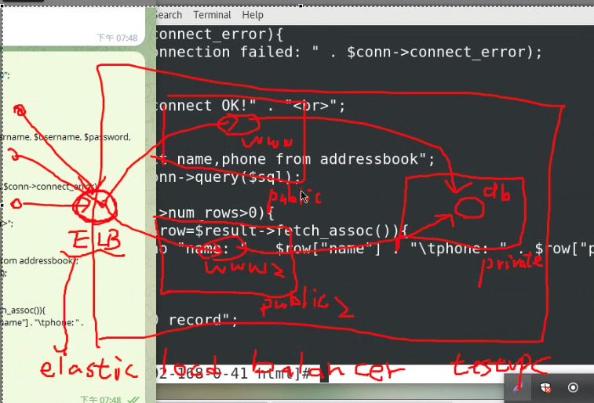
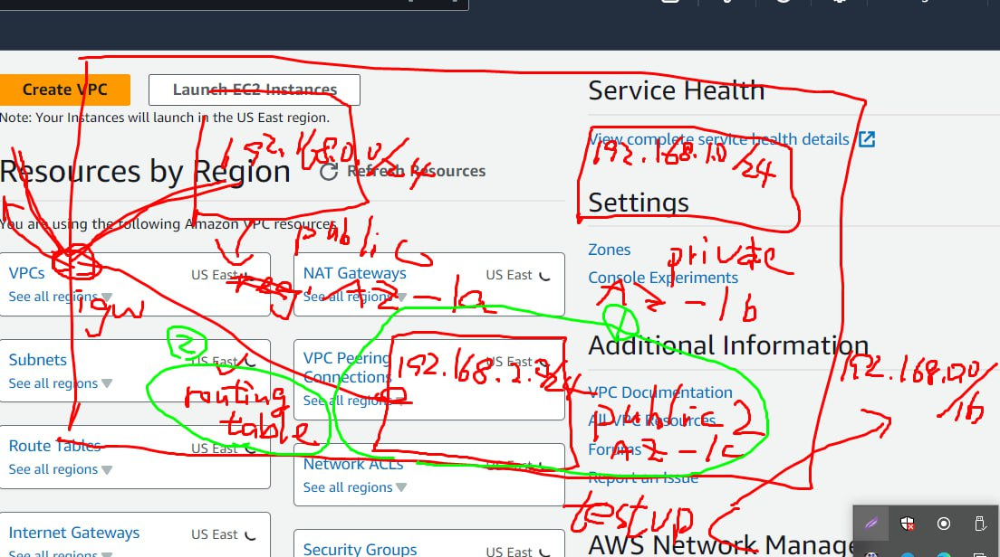
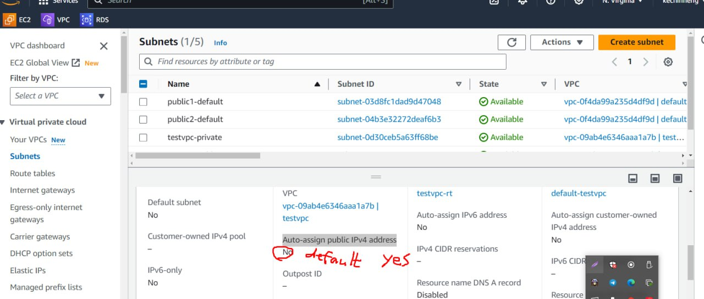
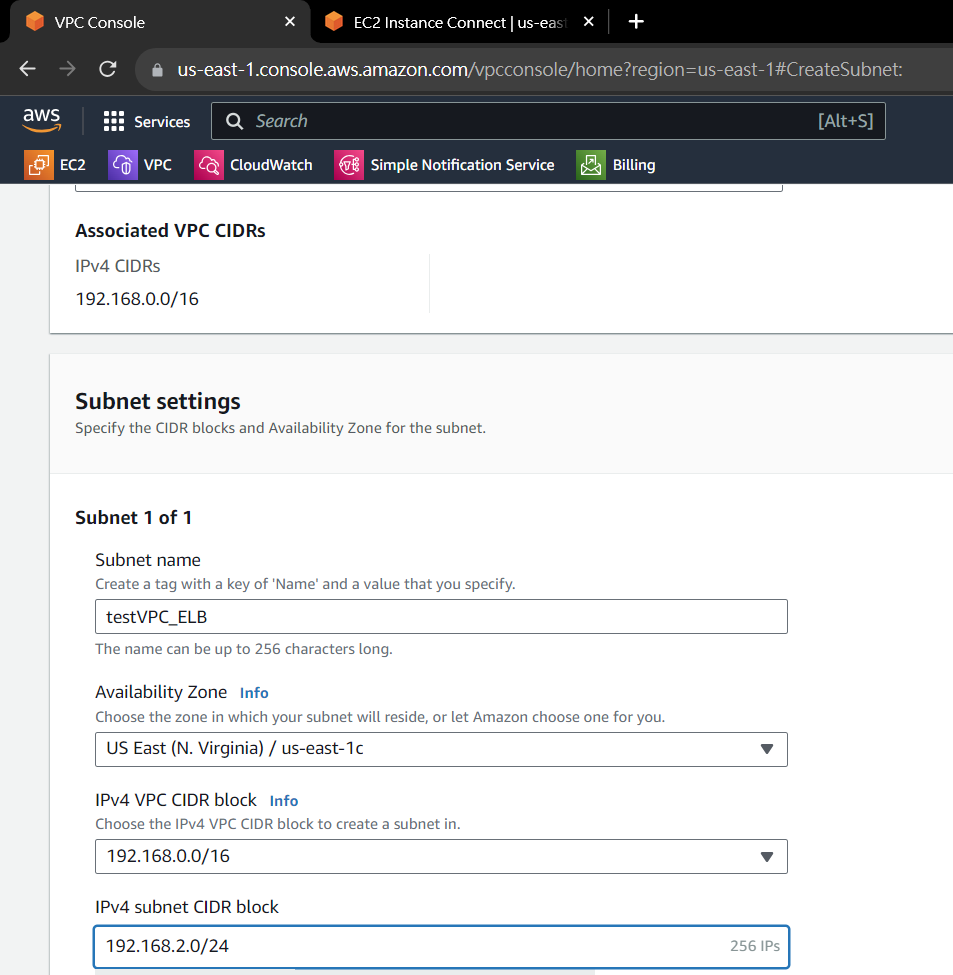
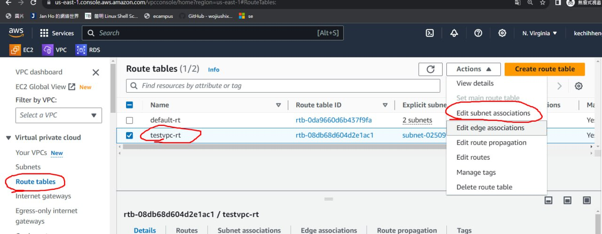
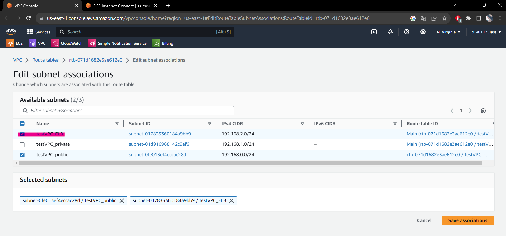

## 前情提要
設定 NAT gateway 從 Public 連到 Private，讓 Private 可以連到外網更新 MariaDB。

# Class 5

```bash
ssh -i  {檔名}.pem ec2-user@{IP}
mysql -u root -p -h
```



```SQL
/* 顯示目前有的資料庫 */
show databases;   
/* 創建資料庫 */
create database testdb;   
/*  使用資料庫 */
use testdb;  
/* 創建資料表 */
create table addrbook(name varchar(50) not null, phone char(10));
/* 加入資料 */
insert into addrbook(name, phone) values ("tom", "0912123456");
insert into addrbook(name, phone) values ("mary", "0912123567");
insert into addrbook(name, phone) values ("peter", "0955523567");
/* 修改資料 */
update addrbook set phone = "0912345678" where name = "peter";
/* 查看修改資料 */
select * from addrbook where name = "peter";
/* 選擇資料 */
select name,phone from addrbook; 
```



```bash
sudo yum install httpd -y

sudo yum install php8.1 php8.1-fpm.x86_64 php8.1-mysqlnd.x86_64 -y

sudo passwd root
> 123456
su

systemctl restart httpd

# 測試 PHP 是否正常運作，建立 info.php 在/var/www/html/

$ sudo vim /var/www/html/info.php
```

> info.php

```php
<?php phpinfo(); ?>
```



> 建立 READ_DB.php

```php
<?php
$servername="192.168.1.199";
$username="user";
$password="user";
$dbname="testdb";

$conn = new mysqli($servername, $username, $password, $dbname);

if($conn->connect_error){
    die("connection failed: " . $conn->connect_error);
}
else{
    echo "connect OK!" . "<br>";
}

$sql="select name,phone from addrbook";
$result=$conn->query($sql);

if($result->num_rows>0){
    while($row=$result->fetch_assoc()){
        echo "name: " . $row["name"] . "\tphone: " . $row["phone"] . "<br>";
    }
} else {
    echo "0 record";
}
?>
```



## Elastic Load Balancing - 負載平衡器



將 public server 匯出印象檔，即可複製許多 server 服務更多用戶










