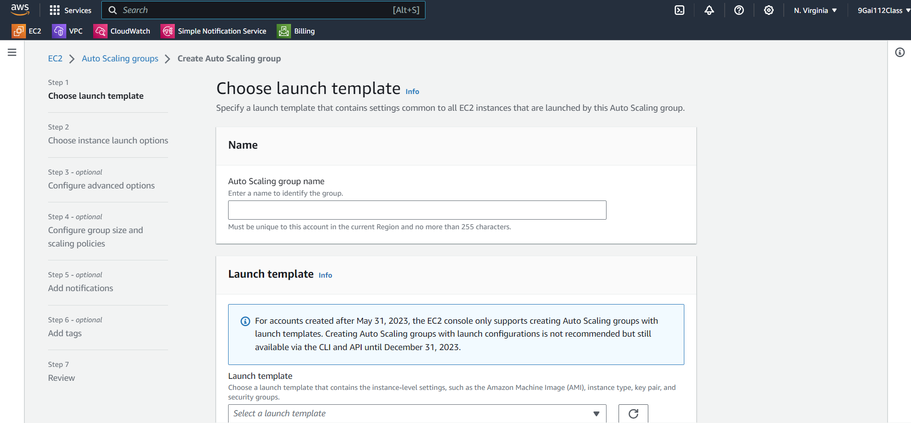
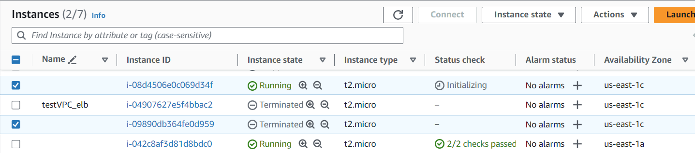
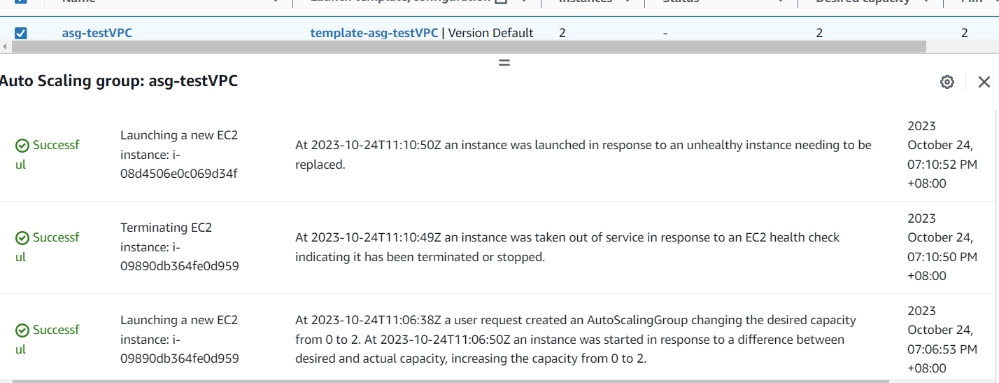

## ASG（Auto Scaling Group）

> 是 AWS 提供的一種自動擴展服務，它可以幫助您根據需求動態地增加或減少 EC2 實例的數量。ASG 可以用來提高應用程式的可用性、性能和成本效益。

### ASG 和 ELB 可以結合使用，以提高應用程式的可用性、性能和成本效益。

在 ASG+ELB 的架構中，Client 可以垂直(vertical)擴展或水平(horizontal)擴展。

垂直擴展：Client 可以增加硬體資源，以提高單個 Client 的處理能力。
水平擴展：Client 可以在多個裝置上部署，並通過 ELB 將流量分發到多個 Client 上。

