## serverless service

Serverless service 是一種雲端服務，它允許您在不管理伺服器的情況下開發和部署應用程式。Serverless service 通常使用雲端供應商的自動化基礎設施來處理伺服器管理的所有細節，例如硬體、軟體、維護和更新。

* 簡化管理：您無需管理伺服器，因此可以專注於開發和部署應用程式。
* 失去可控性：您可能會失去對伺服器的某些控制權。

## relational database service (RDS)

Relational database service (RDS) 是一種雲端資料庫服務，它允許您在雲端中部署關係型資料庫。RDS 提供了多種關係型資料庫，例如 MySQL、PostgreSQL、Oracle 和 SQL Server。

> AWS 會自動幫你更新管理資料庫，計時付費

```
EBS (Elastic Block Store)
EFS (Elastic File System)
EIP (Elastic IP)
IAB
----- No SQL -----
BOTO3
S3 
route 53
Terraform
```

### 關閉 AWS 帳戶

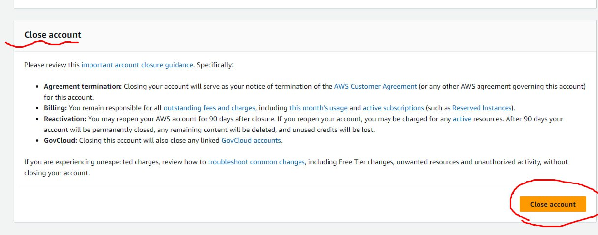

---

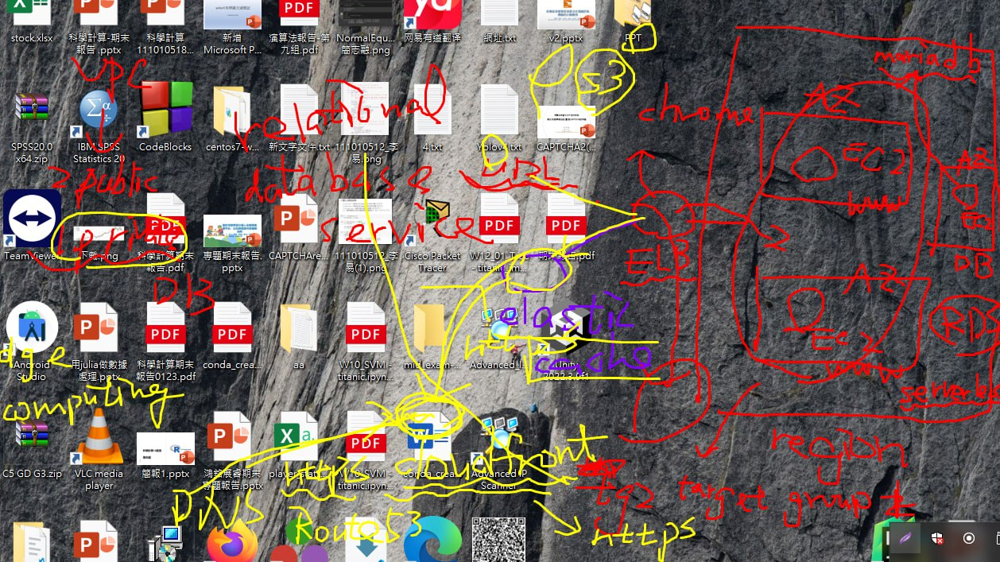

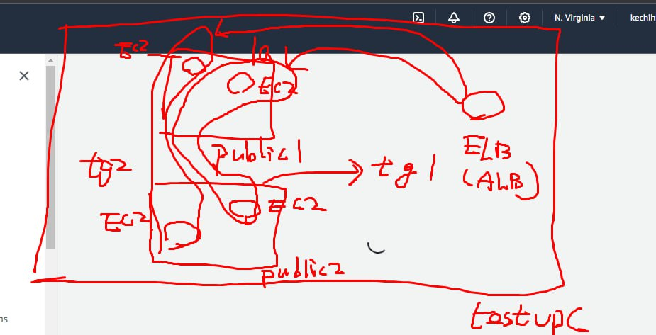

```bash
#!/bin/bash

########################################
##### USE THIS WITH AMAZON LINUX 2 #####
########################################

# get admin privileges
sudo su

# install httpd (Linux 2 version)
yum update -y
yum install -y httpd.x86_64
systemctl start httpd.service
systemctl enable httpd.service
echo "Hello World from $(hostname -f)" > /var/www/html/index.html
```
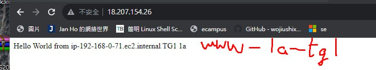

## ALB

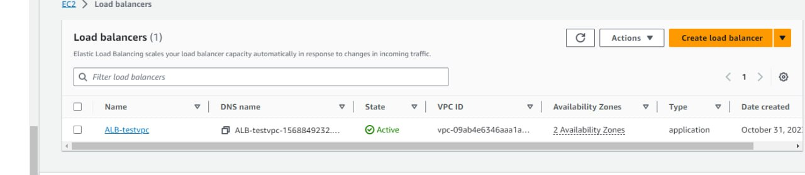

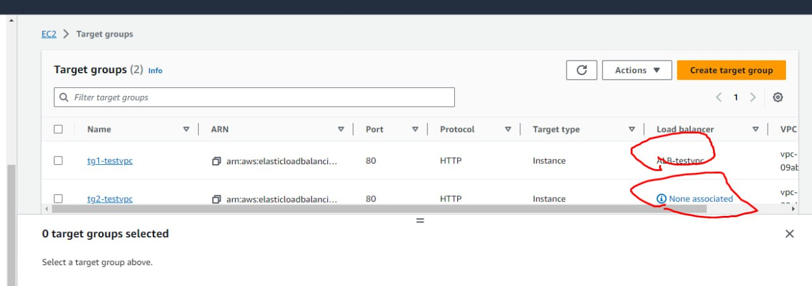

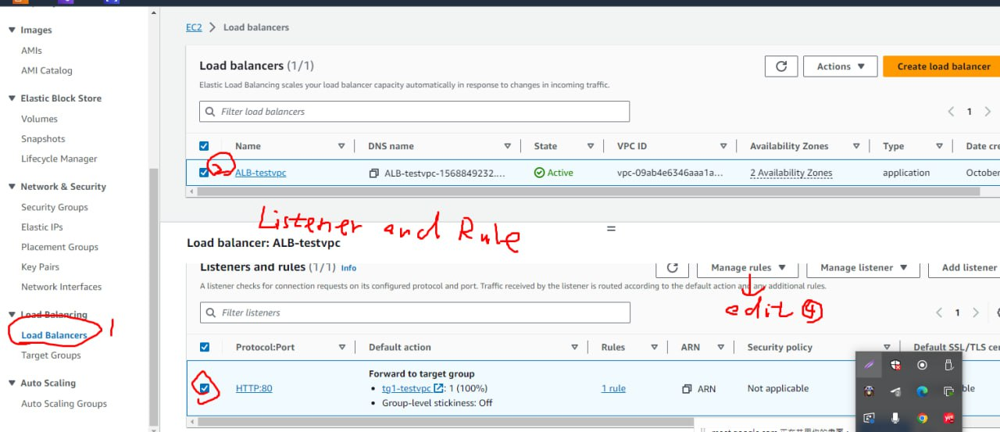

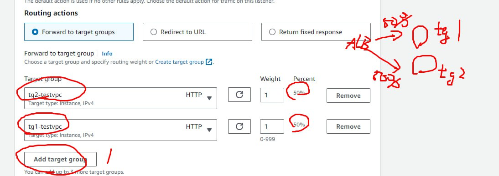

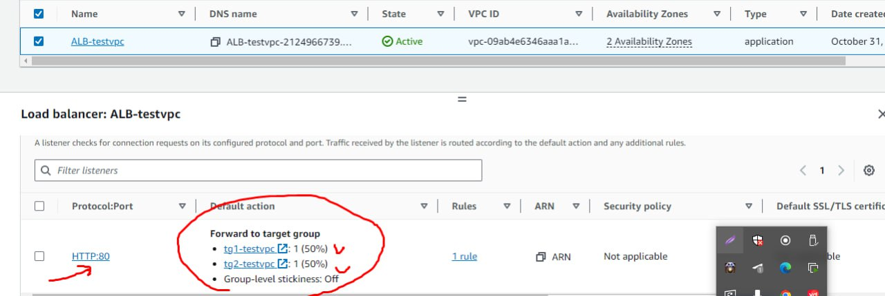

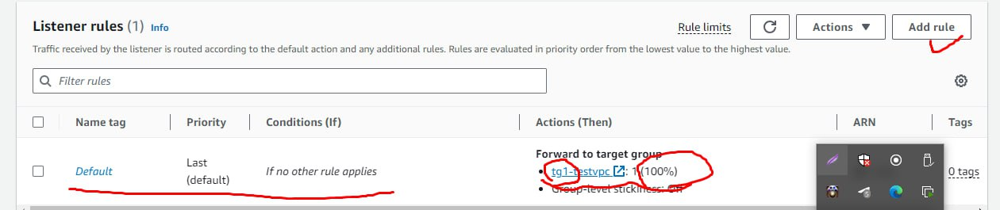

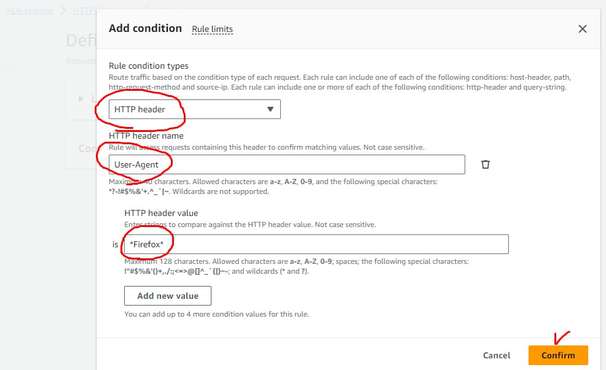

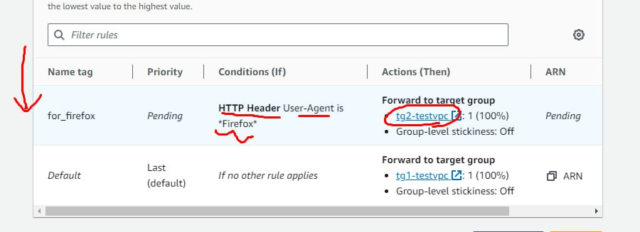

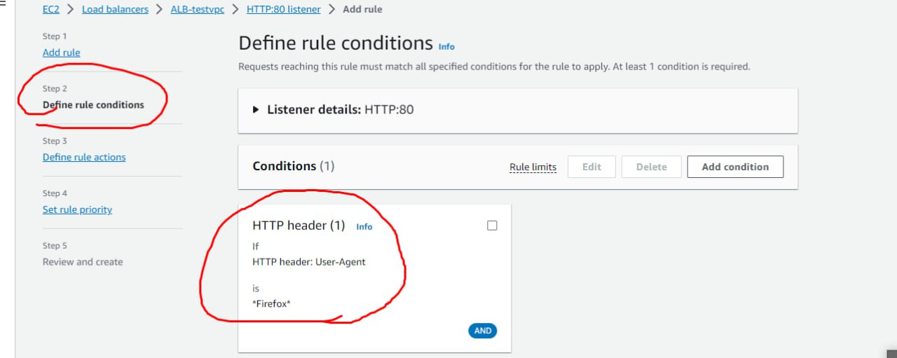

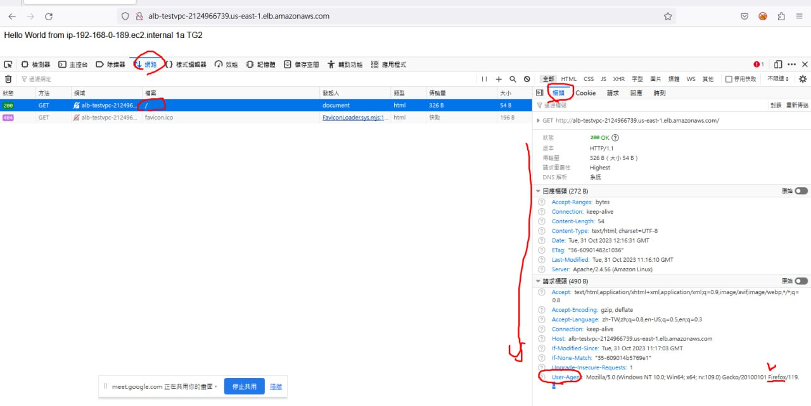

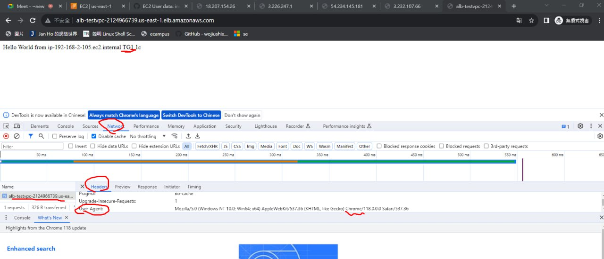

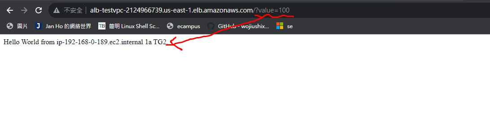

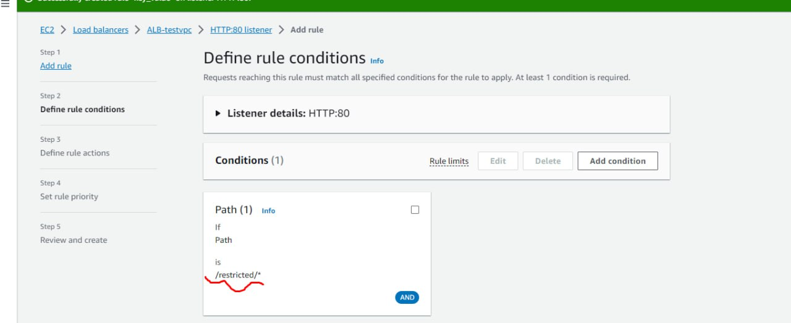

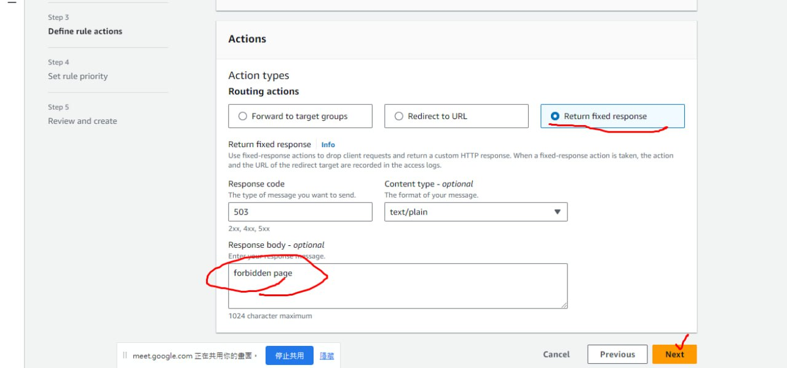

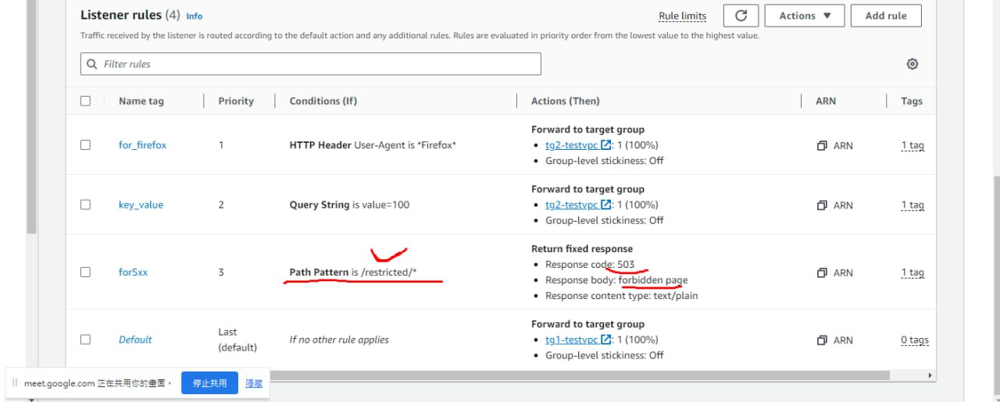

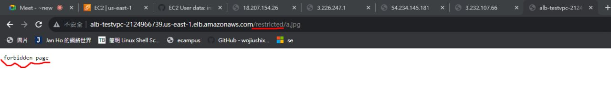


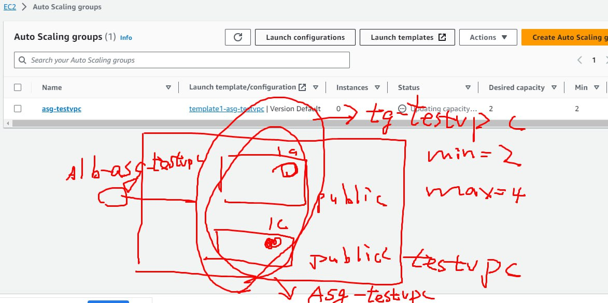

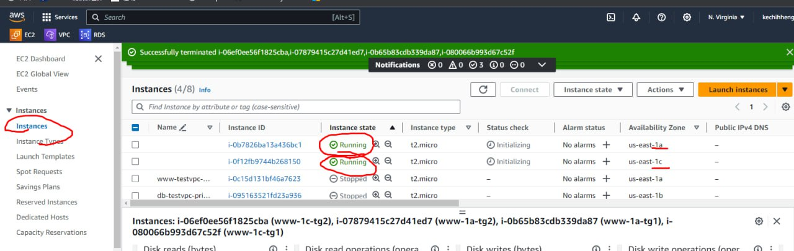

