## 固定 enp0s8 的 IP


## basic
network and NetworkManager(week11)

```
systemctl stop NetworkManager
systemctl start network 
```


add new file (or add to the file end)

```
vim /etc/sysconfig/network-scripts/ifcfg-enp0s3
```

```
DEVICE="enp0s3" 
NAME="enp0s3"
HARDWARE="08:00:27:4a:b0:ac" 
ONBOOT=yes
BOOTPROTO=static
IPADDR=10.0.2.100
NETMASK=255.255.255.0
GATWAY=10.0.2.2
```

---

## Change a Hostname

```
su
hostnamectl
hostnamectl set-hostname [centos7-1]
// hostname 更改完後可輸入 bash 檢視新名稱

sudo vim /etc/hosts(按I編輯)
```

在檔案中增加`[192.168.56.101] [centos7-1]`和`[192.168.56.102] [centos7-2]`（兩台虛擬機的資料）

---

## SSH無密碼登錄

```
su
getenforce  //Security Enhanced Linux 開啟與否
setenforce 0  //臨時關閉

systemctl status firewalld
systemctl stop firewalld  //臨時停止 firewalld 服務

service  iptables status
chkconfig iptables off  //永久停止 iptables 服務

systemctl status sshd


ssh-keygen  //生成私鑰、公鑰對
ssh-copy-id root@centos7-2  //將自己的公鑰給對方

ssh root@centos7-2  //即可連線

touch a.txt
scp a.txt root@centos7-2:/root/
```

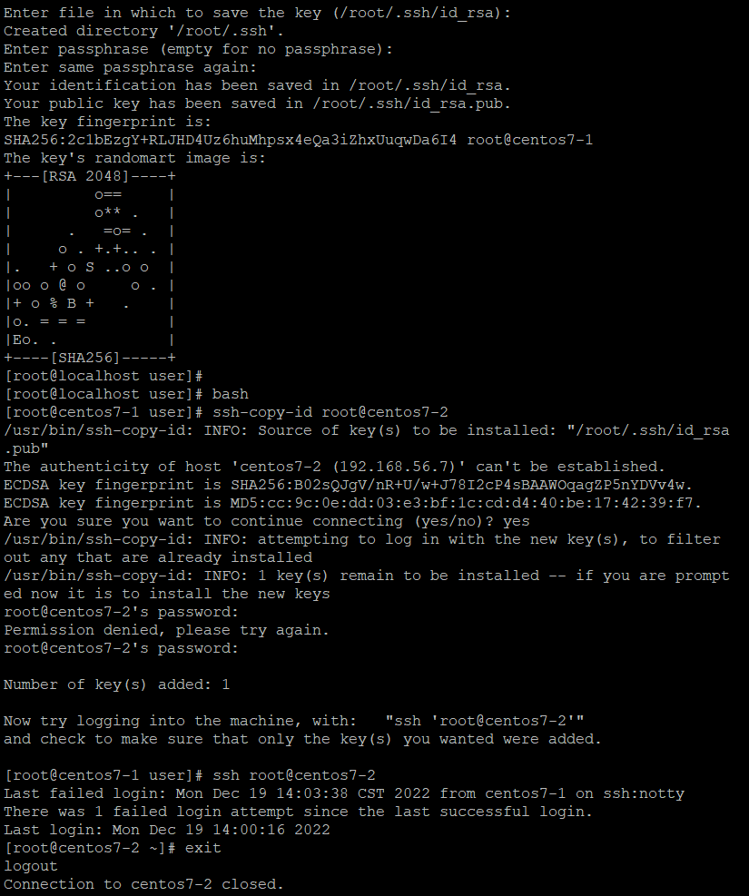

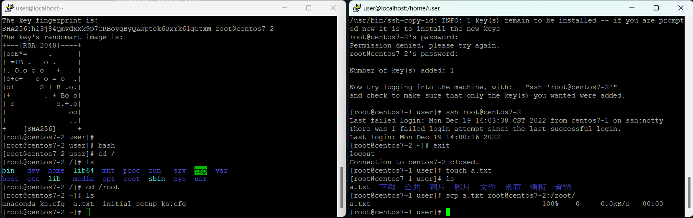

---

## SCP

參考：https://ailog.tw/lifelog/2020/04/08/scp/

[YUM安裝語法]
yum install openssh-clients

[scp使用方式]
scp 本地端檔案或資料夾路徑 [目的地端登入帳號]@[目的地端主機IP]:/[目的地端檔案存放路徑]
傳送檔案範例指令：
scp 123.txt root@192.168.1.10:/root/

傳送資料夾範例指令：
scp -r /home root@192.168.6.124:/home/

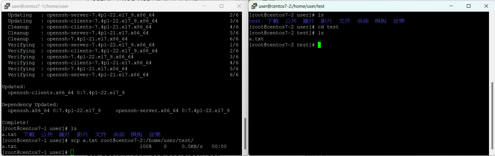

---

## FTP(week15)

> setup

```
$ rpm -qa | grep vsftpd  # 查看是否有安裝FTP
$ yum install vsftpd

$ netstat -tunlp | grep 21  # 檢查有沒有開啟 FPT port
$ systemctl start vsftpd
```

set anonymous login

```
$ chmod 777 /var/ftp/pub
$ vim /etc/vsftpd/vsftpd.conf
```

把下面的權限打開，拿掉註解，讓匿名使用者也可以傳送資料

```
anonymous_enable=YES
anon_upload_enable=YES
anon_mkdir_write_enable=YES
```

加入權限

```
anon_other_write_enable=YES
anon_world_readable_only=NO
anon_root=/var/ftp  
```

重新啟動伺服器

```
$ systemctl restart vsftpd
```

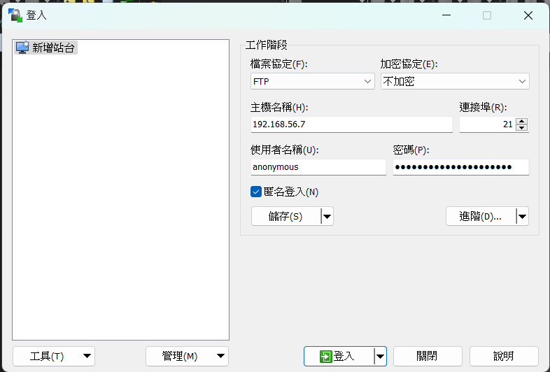

---

## NFS(week02)

>setup

```
$ yum install nfs-utils
$ systemctl start rpcbind
$ systemctl start nfs
$ mkdir /home/user/mydata -p  # 參數p代表資料夾如果不存在就建立，存在就不建立，防呆的
$ chmod 755 /home/user/mydata
$ vim /etc/exports  # 修改檔案設定，分享檔案
```

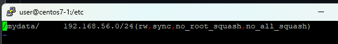

```
$ sudo systemctl restart nfs
$ showmount -e localhost
```

client

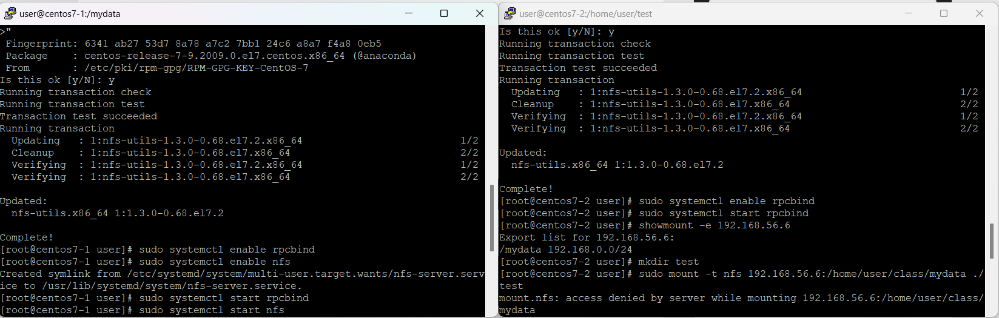

```
$ yum install nfs-utils
$ systemctl enable rpcbind
$ systemctl start rpcbind

$ showmount -e 192.168.56.125  # 測試NFS Server

$ mkdir /home/user/test
$ sudo mount -t nfs 192.168.56.6:/mydata /home/user/test
```

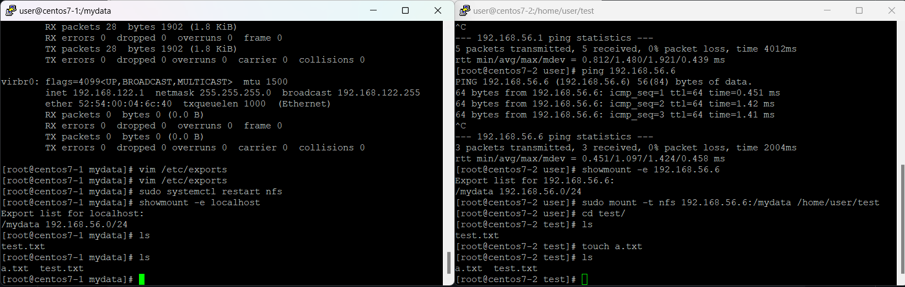


---

## talnet(week12)

```
$ yum install -y telnet*
$ yum install -y xinetd
$ vim /etc/xinetd.d/telnet
```

set config

```
service telnet
{
  flage = REUSE
  socket_type = stream
  wait = no
  user = root
  server =/usr/sbin/in.telnetd
  log_on_failure += USERID
  disable = no
}
systemctl restart xinetd
ps -ef | grep xinetd  # 執行監控程式碼，有客戶端連進來，就會讓telnet運行
ps -ef | grep telnet  # 沒有客戶端，telnet不會執行
```

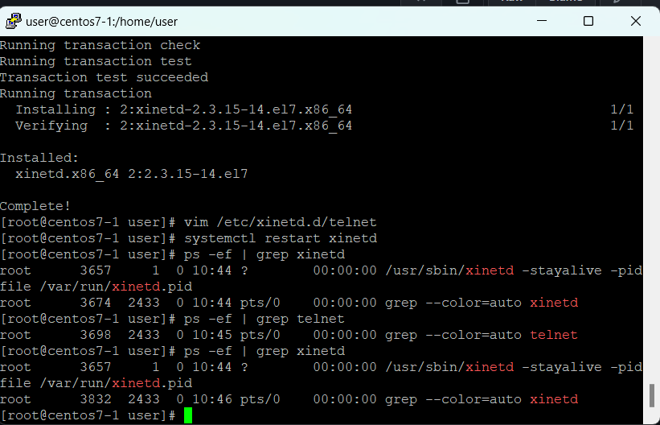

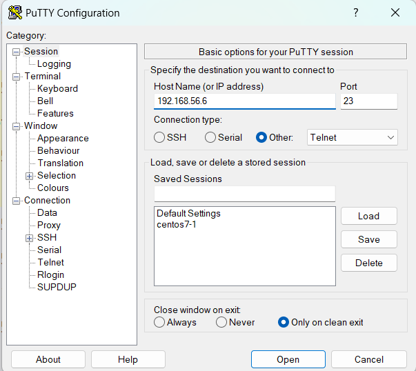

---

## SAMBA(week03)

參考：

```
$ yum install samba samba-client samba-common -y
```

設定smb password (帳號:user, 密碼:123456)

```
$ smbpasswd -a user
```

建立測試資料夾

```
$ cd /
$ mkdir test_samba  # 建立測試資料夾
$ chown nobody ./test_samba/  # 設定權限為nobody(設定沒有擁有者)
$ chmod 777 ./test_samba/  # 設定權限讓其他人可以寫入
$ ll ./test_samba/ -d  # 查看資料夾權限 # 需要加上 -d
```

設定 config `vim /etc/samba/smb.conf`，並給權限

```
[test]  # 設定進入資料夾名稱(在windows上看到的)
        comment = for test  # 註解，標明用意
        path = /test_samba  # 測試資料夾位置(要設到root下)
        read only = no  # 可以寫入的
        guest ok = yes  # 可以給一般使用者使用
        browseable = yes  # 可以瀏覽的
```

啟動SAMBA

```
$ testparm  # 測試設定的參數有沒有問題
$ systemctl start smb
```

在Window上進入SAMBA server

```
# SAMBA
win+R >> //192.168.56.6
```

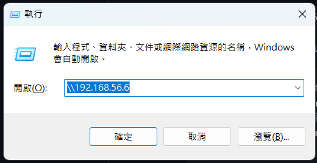

---

## ngrok

```
$ yum install epel-release  # 安裝第三方軟體資料庫
$ yum install snapd
$ systemctl enable --now snapd.socket
$ snap install ngrok  # 安裝ngrok
$ wget https://bin.equinox.io/c/bNyj1mQVY4c/ngrok-v3-stable-linux-amd64.tgz --no-check-certificate
$ tar xvfz ngrok-v3-stable-linux-amd64.tgz
```

use forward to connect

```
$ ./ngrok config add-authtoken 21wkXensqm65Mg4kaN5kqIFi5lm_7ad7fFjoZzeeRTVoagAri
$ ./ngrok http 80
```

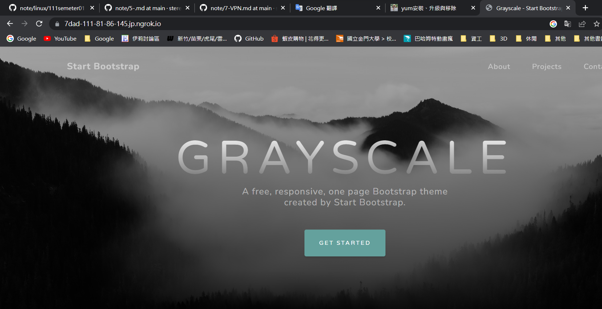

---

## SFTP

參考：https://cloud.tencent.com/developer/article/1844272

```
一、创建sftp组：

[root@localhost ~]# groupadd sftp

二、创建一个用户sftpuser：

[root@localhost ~]# useradd -g sftp -s /sbin/nologin sftpuser

三、设置sftpuser用户的密码

[root@localhost ~]# echo "123456" | passwd --stdin sftpuser

四、创建一个sftp的上传目录：

[root@localhost ~]# mkdir -p /home/sftp/sftpuser

五、修改用户sftpuser所在的目录：

[root@localhost ~]# chown -R sftpuser.sftp /home/sftp/sftpuser

六、配置sshd_config：

[root@localhost ~]# vim /etc/ssh/sshd_config

找到Subsystem sftp /usr/libexec/openssh/sftp-server，注释掉这行，并添加以下内容

#这行指定使用sftp服务使用系统自带的internal-sftp

Subsystem sftp internal-sftp

#这行用来匹配用户

Match User sftpuser

#用chroot将用户的根目录指定到/home/sftp，这样用户就只能在/home/sftp下活动

ChrootDirectory /home/sftp

AllowTcpForwarding no

#指定sftp命令

ForceCommand internal-sftp

#保存退出

PS：注意ChrootDirectory设置的目录/data_share/dingli/的所有者必须是root,并且该目录的上级目录data_share的所有者也必须是root.

为什么用 internal-sftp 而不用默认的 sftp-server，这是因为： 这是一个进程内的 sftp 服务，当用户 ChrootDirectory 的时候，将不请求任何文件；更好的性能，不用为 sftp 再开一个进程。

七、重启SSHD服务

[root@localhost ~]# systemctl restart sshd.service
```

new sftp user

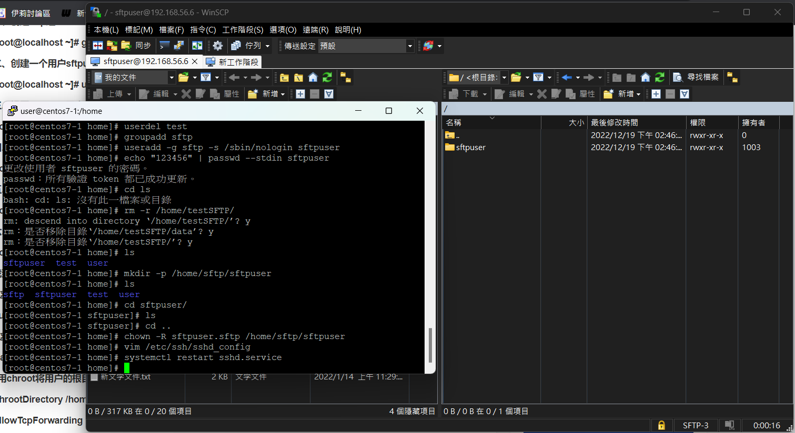

```
$ sudo adduser sftpuser
$ sudo passwd sftpuser
123456 #passwd
```

---

## TCP/IP server (echo_server) (week12)

```
$ vim echo_server.py
```
如果還沒下載PY：`yum install python3`
```
#!/usr/bin/env python3
import socket

serv = socket.socket(socket.AF_INET, socket.SOCK_STREAM)
serv.bind(('0.0.0.0', 9090))
serv.listen(9090)

while True:
    conn, addr = serv.accept()
    print('Client from', addr)

    while True:
        data = conn.recv(1024)
        if not data: break
        conn.send(data)

    conn.close()
    print('Client disconnected')
$ chmod +x echo_server.py
$ vim /etc/systemd/system/echo_server.service
```

編輯 systemctl config

```
[Unit]
Description=Echo Server

[Service]
Type=simple
ExecStart=/opt/echo_server.py
Restart=always

[Install]
WantedBy=multi-user.target
```

更改 echo_server.service permission

```
$ chmod 644 /etc/systemd/system/echo_server.service
$ systemctl daemon-reload  # 重新載入 Systemd 設定檔
$ systemctl start echo_server  # 啟動自訂的 echo 伺服器
```

client connect

```
nc localhost 9090
```

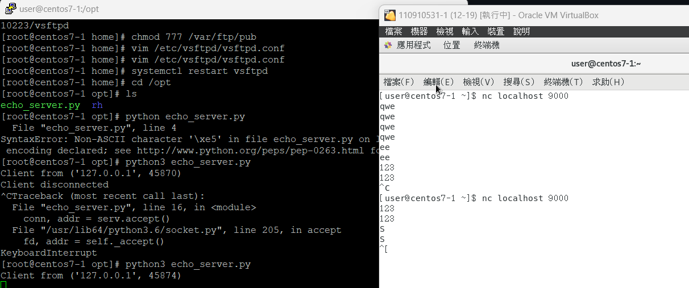

---

## VPN(week07)

參考：https://exfast.me/2016/05/centos-install-7-x-vpn-pptp/

```
$ yum install epel-release -y
$ yum clean all -y
$ yum update -y
$ yum install -y ppp pptpd  # ppp是撥接的程式，主要是要裝後面的pptpd
$ vim /etc/pptpd.conf
```

edit remote virtual interface

```
#localip 192.168.0.1
#remoteip 192.168.0.234-238,192.168.0.245
localip 192.168.0.1
remoteip 192.168.0.100-200
```

set account、servername、password and which IP can access

```
$ vim /etc/ppp/chap-secrets
# Secrets for authentication using CHAP
# client server secret IP addresses
test pptpd 123456 *    
```

add ifconfig ppp0 mtu 1472

```
$ vim /etc/ppp/ip-up
/etc/ppp/ip-up. ipv6to4 ${LOGDEVICE}
[ -x /etc/ppp/ip-up.local ] && /etc/ppp/ip-up.local “$@”
ifconfig ppp0 mtu 1472
```

change computer to router mode

```
$ vim /etc/sysctl.conf
```

add to the end of file

```
net.ipv4.ip_forward = 1
```

參數啟用(啟用上面的電腦變成路由器)

```
$ sysctl -p
```

連線到之後就可以使用Windows進行連接：

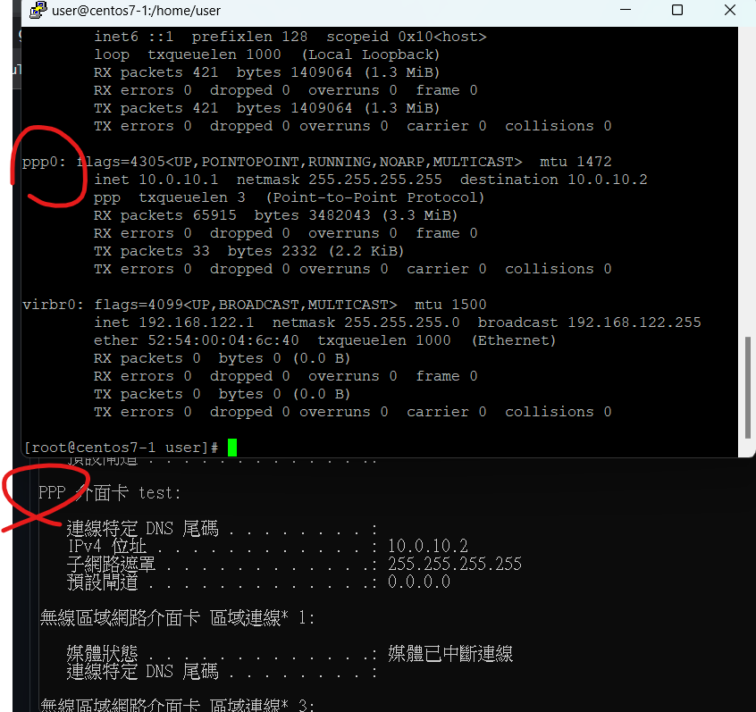

---

## Apache Server

> 安裝Apache

```
$ sudo yum install httpd
$ sudo systemctl start httpd.service
```

> 關閉防火牆

```
$ setenforce 0
$ systemctl stop firewalld
$ vim /etc/selinux/config
```

把SELINUX改成disable，然後重新開機

```
SELINUX = disable
```

> 檢查配置檔案，可以改Listen把port改成想要的位置

```
$ cat /etc/httpd/conf/httpd.conf | grep Listen
```

安裝完成後，在瀏覽器測試是否運行

http://[192.168.56.6]

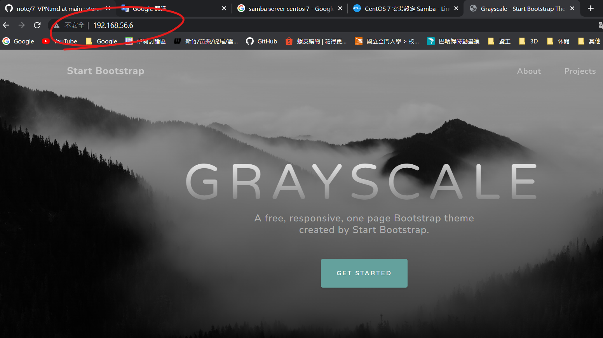

---

## LAMP

(week13、week14、week15)

server

> http

```
$ yum install httpd
$ systemctl start httpd.service
```

> sql

```
$ yum install mariadb-server mariadb
$ systemctl start mariadb
# [Disallow root] and [Remove test] set N, and others enter(pass)
$ mysql_secure_installation  # set root passwd
$ mysql -u root -p  # open sql
```

db create

```
create database testdb;  
use testdb;  
create table addrbook(name varchar(50) not null, phone char(10));
insert into addrbook(name, phone) values ("aaa", "0912123456");
insert into addrbook(name, phone) values ("bbb", "0912123567");
select name,phone from addrbook;
```

> PHP

```
$ yum install php php-mysql php-fpm
$ systemctl restart httpd.service
$ vim /var/www/html/info.php
```

info.php

```
<?php phpinfo(); ?>
```

test: http://192.168.56.125/info.php

> connect SQL, PHP and httpd

```
$ vim /var/www/html/Link.php
```

Link.php

```
<?php
$servername="127.0.0.1";
$username="root";    
$password="centos";
$dbname="testdb";

$conn = new mysqli($servername, $username, $password, $dbname);

if($conn->connect_error){
    die("connection failed: " . $conn->connect_error);
}
else{
    echo "connect OK!" . "<br>";
}

$sql="select name,phone from addrbook";
$result=$conn->query($sql);

if($result->num_rows>0){
    while($row=$result->fetch_assoc()){
        echo "name: " . $row["name"] . "\tphone: " . $row["phone"] . "<br>";
    }
} else {
    echo "0 record";
}
?>
```

---

## virtual host

```
$ cd /var/www
$ mkdir a.com
$ mkdir b.com
$ echo "www.a.com" > ./a.com/index.html
$ echo "www.b.com" > ./b.com/index.html
$ cd /etc/httpd/conf.d
$ vim a.com.conf   
<VirtualHost *:80>
    ServerName a.com
    ServerAlias www.a.com
    ServerAdmin webmaster@a.com
    DocumentRoot /var/www/a.com

    <Directory /var/www/a.com>
        Options -Indexes +FollowSymLinks
        AllowOverride All
    </Directory>

    ErrorLog /var/log/httpd/a.com-error.log 
    CustomLog /var/log/httpd/a.com-access.log combined
</VirtualHost>
$ vim b.com.conf
<VirtualHost *:80>
    ServerName b.com
    ServerAlias www.b.com
    ServerAdmin webmaster@b.com
    DocumentRoot /var/www/b.com

    <Directory /var/www/b.com>
        Options -Indexes +FollowSymLinks
        AllowOverride All
    </Directory>

    ErrorLog /var/log/httpd/b.com-error.log 
    CustomLog /var/log/httpd/b.com-access.log combined
</VirtualHost>
$ systemctl restart httpd
```

client

windows: modify file: C:\Windows\System32\drivers\etc\hosts

```
192.168.56.125    www.a.com
192.168.56.125    www.b.com
```

and brows: http://192.168.56.125/www.a.com、http://192.168.56.125/www.b.com

> add secure file

```
$ vim /etc/httpd/conf.d/a.com.conf
<VirtualHost *:80>
    ServerName a.com
    ServerAlias www.a.com
    ServerAdmin webmaster@a.com
    DocumentRoot /var/www/a.com

    <Directory /var/www/a.com>
        Options Indexes FollowSymLinks
        AllowOverride All
    </Directory>
    
	<Directory /var/www/a.com/secure>
		AllowOverride AuthConfig
	</Directory>
	
    ErrorLog /var/log/httpd/a.com-error.log
    CustomLog /var/log/httpd/a.com-access.log combined
</VirtualHost>
```

add .htpasswd

```
$ cd /var/www/a.com
$ mkdir secure; cd secure
$ htpasswd -c .htpasswd user
$ vim .htaccess  # 創造.htaccess資料
```

set .htaccess

```
AuthType Basic
AuthName "Private File Area"
AuthUserFile /var/www/a.com/secure/.htpasswd
Require valid-user
```

---

# ApacheSetup

在設定安全機制或是防火牆的時候，要先關閉伺服器

```
# 查看security linux有沒有設定，如果是premission就要使用下面的指令disable security linux
$ getenforce  

# 暫時關閉
$ setenforce 0

# 永久關閉
$ vim /etc/selinux/config   # 設定: SELINUX = disabled
# 查看防火牆有沒有開
$ systemctl status firewalld
```

## 重要Apache目錄

- `/etc/httpd`: 主要安裝目錄
  - conf.d是主要配置檔，cond也是配置檔，用兩個配置檔比較不會太亂
  - logs是記錄檔(連結)，對應到`/var/log/httpd`，裡面會有紀錄內容
- `/var/log/httpd`: 裡面會有網頁紀錄內容
- `/var/www/html`: 家目錄位置，可以html放在裡面
- `/etc/httpd/conf/httpd.conf`: apache 的主設定檔，所有和伺服器運作有關的設定值都放在這個文字檔中

centos7的環境和ubundu是不一樣的，如果是在ubundu，家目錄會在`/usr/local/apache2/htdocs/`下面

在`/etc/httpd/conf.d`裡面可以在網站中再架一個虛擬網站，就是下面的virtual host

---

- [x] FTP
- [x] TCP/IP server (echo)
- [x] Apache user
- [ ] virtual host
- [x] talnet

