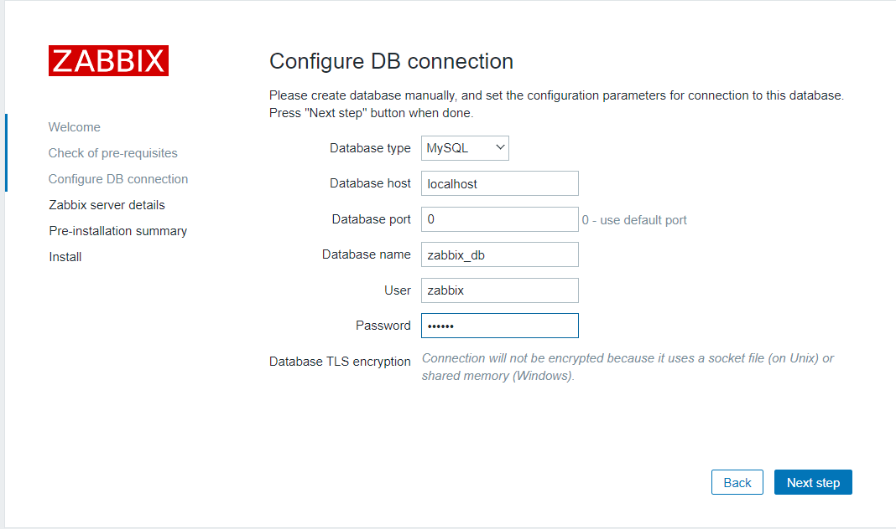
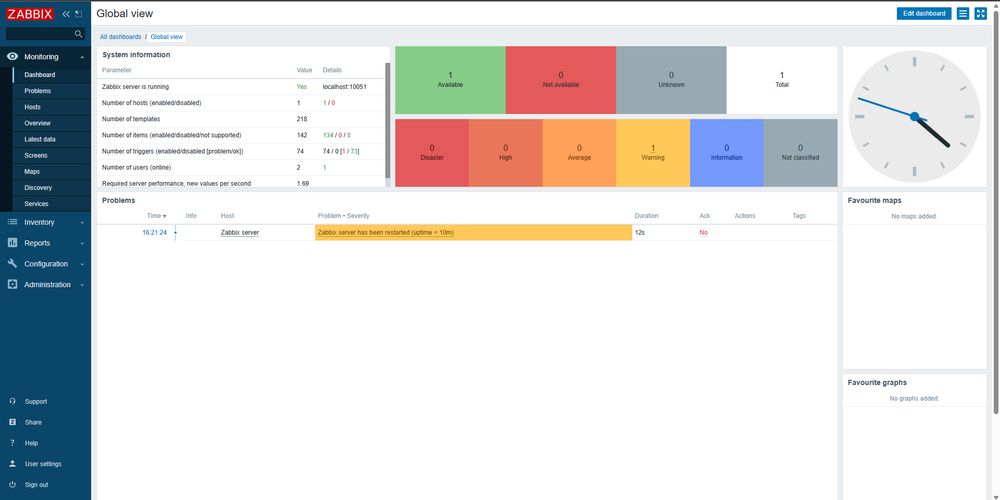

# Zabbix

使用zabbix做監控系統，我們會使用到三台虛擬機

https://cloud.tencent.com/developer/article/1943154


```sh
$ sudo yum install mariadb-server mariadb -y
```

> set up db

db

> 設定root密碼，除了設定root外，其他選項Disallow root和Remove test選n，其他都Enter跳過

```sh
$ mysql_secure_installation 
```

登入db

```sh
$ mysql -u root -p
$ create database zabbix_db character set utf8 collate utf8_bin;
$ create user zabbix@localhost identified by 'centos';  # 設定密碼為centos
$ grant all privileges on zabbix_db.* to zabbix@localhost;  # 讓zabbix使用zabbix_db全部權限
$ quit;
```


> install zabbix

到[zabbix官網](https://www.zabbix.com/)下載[5.0LTS centos7的版本](https://www.zabbix.com/download?zabbix=5.0&os_distribution=centos&os_version=7&components=server_frontend_agent&db=mysql&ws=apache)，官網的指令如下

```sh
$ rpm -Uvh https://repo.zabbix.com/zabbix/5.0/rhel/7/x86_64/zabbix-release-5.0-1.el7.noarch.rpm
$ yum clean all
$ yum install zabbix-server-mysql zabbix-agent -y
$ yum install centos-release-scl -y
$ vim /etc/yum.repos.d/zabbix.repo
```

> 把enable改成1

```
[zabbix-frontend]
...
enabled=1
...
```

安裝前端軟體

```sh
$ yum install zabbix-web-mysql-scl zabbix-apache-conf-scl -y
```

導入zabbix數據，並輸入剛剛設定的密碼`centos`

```sh
$ zcat /usr/share/doc/zabbix-server-mysql*/create.sql.gz | mysql -uzabbix -p zabbix_db
```

修改帳號密碼

```sh
$ vim /etc/zabbix/zabbix_server.conf
```

> 新增DBPassword和修改DBName

```
DBName=zabbix_db
DBUser=zabbix
DBPassword=centos
```


修改時區

```sh
$ vim /etc/opt/rh/rh-php72/php-fpm.d/zabbix.conf
```

> 設定時區必須要把前面的分號拿掉!

```
php_value[date.timezone] = Asia/Taipei
```

重啟zabbix

```sh
$ systemctl restart zabbix-server zabbix-agent httpd rh-php72-php-fpm
$ systemctl enable zabbix-server zabbix-agent httpd rh-php72-php-fpm
```


> set up zabbix website

開啟http://192.168.42.131/zabbix/setup.php (http://[ip]/zabbix)，就可以看到zabbix的主頁面了

在確認所有功能都OK，就填入必要資訊



後面的步驟，直接使用默認的就OK了，按下next step直到結束


登入使用默認帳號: Admin, 密碼: zabbix，成功就可以進到下面的介面




## 架設客戶端

https://computingforgeeks.com/install-and-configure-zabbix-agent-on-centos/

> install zabbix client

安裝zabbix到兩台client上

```sh
$ sudo yum install https://repo.zabbix.com/zabbix/5.0/rhel/7/x86_64/zabbix-release-$ 5.0-1.el7.noarch.rpm -y
$ sudo yum install vim zabbix-agent zabbix-sender -y
$ sudo vim /etc/zabbix/zabbix_agentd.conf
```

> 下面三個選項作修改

```
Server=[伺服器IP]
ServerActive=[伺服器IP]
Hostname=[自己主機叫做什麼就改成什麼]
```

e.g

```
Server=192.168.42.131
ServerActive=192.168.42.131
Hostname=test
```


```sh
$ sudo systemctl start zabbix-agent
$ sudo systemctl enable zabbix-agent
$ sudo systemctl status zabbix-agent
```

查看有沒有運作

```sh
$ netstat -tunlp | grep zabbix
```


## 設定伺服器端的客戶端連線
> 我 6/7 嘗試連線但完全無法使用，應該是硬體設備的問題。